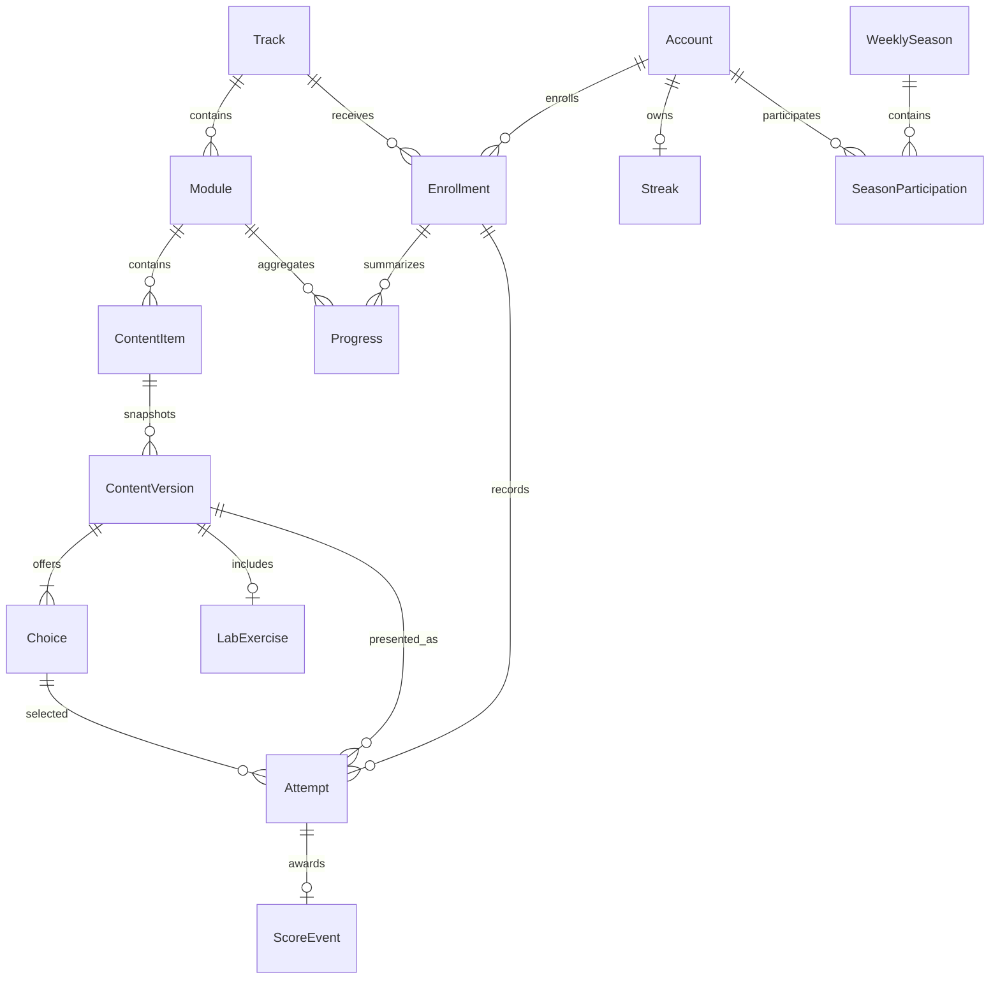

# KronoLearn Domain Contracts

**Status**: Authoritative after feature 004  
**Scope**: Shared domain persistence and extension points. This document does not define learner or administrator workflows.

The executable symbols named here are the stable interfaces for baseline and backlog features. A change to a frozen surface requires coordinated contract review and, when applicable, a new migration owner.

## Entity Model

The 11 shared entities introduced here are `ContentItem`, `ContentVersion`, `Choice`, `LabExercise`, `Enrollment`, `Attempt`, `Progress`, `ScoreEvent`, `Streak`, `WeeklySeason`, and `SeasonParticipation`.

All use non-editable UUID primary keys. Cross-app relationships use `PROTECT`. Published snapshots inherit the append-only `ImmutableModel`. PostgreSQL is authoritative for the inclusive date-range exclusion that prevents overlapping `WeeklySeason` rows; portable checks also require ordered dates. Database uniqueness protects enrollment identity, attempt and score digests, first-scoreable attempts, one score event per attempt, progress aggregates, and season participation.

`ContentVersion.is_current` is derived by comparing its version number with `ContentItem.published_version`. Aggregate publication rules such as consecutive item positions and valid three-or-four-choice sets belong to future locked services, not model methods.

## Service Registry

Parameters shown below are the stable positional interface. `IMPLEMENT` means this feature provides a read or infrastructure operation. `STUB` means the function immediately raises `NotImplementedError` without reads, writes, events, logging, or authorization decisions.

| Function | Parameters | State |
| --- | --- | --- |
| `publish_content_item` | `(content_item, actor, payload)` | STUB |
| `create_content_draft` | `(module, actor, payload)` | STUB |
| `get_published_version` | `(content_item)` | IMPLEMENT |
| `list_published_versions` | `(track)` | IMPLEMENT |
| `enroll` | `(account, track)` | STUB |
| `get_enrollment` | `(account, track)` | IMPLEMENT |
| `list_enrollments` | `(account)` | IMPLEMENT |
| `get_next_content_version` | `(enrollment)` | STUB |
| `is_track_completed` | `(enrollment)` | STUB |
| `register_attempt` | `(enrollment, content_version, choice, idempotency_key)` | STUB |
| `list_attempts` | `(enrollment)` | IMPLEMENT |
| `recompute_progress` | `(enrollment)` | STUB |
| `get_track_progress` | `(enrollment)` | STUB |
| `award_for_attempt` | `(attempt)` | STUB |
| `register_activity` | `(account, activity_date)` | STUB |
| `streak_bonus` | `(streak)` | STUB |
| `current_season` | `(moment)` | IMPLEMENT |
| `leaderboard` | `(season)` | STUB |
| `content_metrics` | `(track)` | STUB |
| `engagement_metrics` | `(window_days)` | STUB |

### Implemented Reads

- `get_published_version` returns only the exact current version of a published item and never falls back.
- `list_published_versions` returns current versions under active modules ordered by module position, content position, and UUID.
- `get_enrollment` returns the unique account/track row or `None`.
- `list_enrollments` returns all statuses ordered by enrollment time and UUID with tracks eagerly loaded.
- `list_attempts` orders by attempt time and UUID with content version and choice eagerly loaded.
- `current_season` rejects naive datetimes, converts aware values to `America/Bogota`, derives Monday through Sunday, and atomically resolves the unique season.

### Stub Policy

Every STUB docstring records the future preconditions, result, ordering where relevant, lack of current side effects, expected errors, authorization ownership, and idempotency rules. Implementing features must turn a STUB into behavior only within their assigned path and must add tests before doing so.

Attempt persistence derives `security_digest(idempotency_key, purpose="learning.attempt.idempotency")`; the raw key is never stored or dispatched. Attempt score events derive `security_digest(str(attempt.id), purpose="gamification.score-event.idempotency")`. A completed-session producer must define its canonical identity before implementation and dispatch only its pre-derived digest.

## Projection Types

All projections are frozen dataclasses.

- `AttemptResult`: attempt, rating, scoreability, consequence, explanation, and source.
- `TrackProgress`: bounded decimal percentage, module-ordered `Progress` tuple, and accuracy; accuracy is `None` when there are no scoreable attempts.
- `LeaderboardEntry`: public display name, position, points, attempt counters, and completed sessions. It contains no email or account identifier.
- `ContentMetrics`: public context, person count, suppression flag, and immutable numeric values.
- `EngagementMetrics`: public context, person count, suppression flag, and immutable numeric values.

Suppressed metric projections always expose an empty mapping. The future metrics implementation must define a named configurable cohort threshold before adding values. Constants are immutable `RATING_POINTS`, `STREAK_BONUS_STEP = 10`, and `STREAK_BONUS_CAP = 50`.

## Domain Events

### `attempt_registered(attempt, result)`

The future `register_attempt` producer sends `learning.signals.attempt_registered` with `sender=register_attempt`, a newly persisted `Attempt`, and its frozen `AttemptResult`. Delivery uses synchronous `send()` inside the producer transaction. Receivers run in registration order; an exception propagates and rolls back the attempt and earlier receiver writes. Committed replay does not emit again. Producer replay and retry behavior remains outside feature 004 while the producer is a STUB.

### `session_completed(enrollment, completed_at, idempotency_key)`

The future session producer sends `learning.signals.session_completed` synchronously with an `Enrollment`, an aware completion datetime, and a pre-derived 64-character digest named `idempotency_key`. It never sends a raw caller token. Receiver failures propagate and roll back the transaction.

`learning` subscribes only its progress hook to `attempt_registered`. `gamification` subscribes scoring, streak, and participation hooks to `attempt_registered`, and participation to `session_completed`. Stable `dispatch_uid` values make repeated `AppConfig.ready()` calls idempotent. The registered hooks are wiring-only until their owner features implement behavior. gamification is the sole writer of `SeasonParticipation`.

## Integration Surfaces

The root URL configuration includes each namespace exactly once: `catalog`, `learning`, `gamification`, and `analytics`. The learning package reserves `learn/enrollments/`, `learn/session/`, `learn/attempts/`, and `learn/progress/`; gamification and analytics expose empty namespaced aggregators. Unimplemented leaf routes remain absent. The daily-session leaf exposes only `learning:session-current(track_id)` as an authenticated temporary placeholder; its owner may replace the response while preserving that name and argument.

The base template keeps `title`, nests legacy `content` inside `main`, and provides `sidebar`, `fragments`, and `scripts`. It renders semantic navigation and preserves visible keyboard focus rules.

Each installed app may publish an immutable `NAV_ITEMS` tuple. `ui.navigation` discovers optional declarations, rejects duplicate keys, filters from authenticated server-side account state and roles, omits unresolved routes, and returns immutable entries ordered by `(order, key)`. No account identifier is included in a navigation URL or form.

`seed_demo` atomically creates or repairs the recognized minimal aggregate. Its private natural keys are two non-personal `.invalid` emails held only by authoritative Account rows. Its output contains counts and public track titles only. Outside debug mode, `--confirm-production` is mandatory before writes and demo accounts have unusable passwords.

## Ownership Matrix

The editable path sets below are intentionally non-overlapping.

| Baseline feature | May modify | Must not modify |
| --- | --- | --- |
| Autoría de contenido | `catalog/services/content.py`, `templates/catalog/content/**`, `tests/catalog/content/**` | Models, migrations, root URLs, base template |
| Inscripción | `learning/services/enrollment.py`, `learning/urls/enrollment.py`, `learning/views/enrollment/**`, `templates/learning/enrollment/**`, `tests/learning/enrollment/**` | Other learning areas and frozen paths |
| Sesión diaria | `learning/services/session.py`, `learning/urls/session.py`, `learning/views/session/**`, `templates/learning/session/**`, `tests/learning/session/**` | Other learning areas, frozen paths, participation writes |
| Intento y retroalimentación | `learning/services/attempts.py`, `learning/urls/attempts.py`, `learning/views/attempts/**`, `templates/learning/attempts/**`, `tests/learning/attempts/**` | Signals, models, and other learning areas |
| Ruta y progreso | `learning/services/progress.py`, `learning/receivers.py`, `learning/urls/progress.py`, `learning/views/progress/**`, `templates/learning/progress/**`, `tests/learning/progress/**` | Signals, models, and other learning areas |
| Puntos, racha y participación | `gamification/services/scoring.py`, `gamification/services/streaks.py`, `gamification/receivers.py`, `templates/gamification/**`, `tests/gamification/scoring/**`, `tests/gamification/streaks/**` | Models, migrations, root composition |

## Backlog Traces

| Backlog feature | Reserved implementation | Existing read contract |
| --- | --- | --- |
| Liga semanal | `gamification/services/seasons.py` and leaderboard views/templates/tests | `WeeklySeason`, `SeasonParticipation`, `LeaderboardEntry` |
| Métricas administrativas | `analytics/services/metrics.py` and analytics views/templates/tests | `ContentMetrics`, `EngagementMetrics`, published catalog queries |
| Insignias | New approved gamification service/view/test paths | `Attempt`, `Progress`, `ScoreEvent`, `Streak` |
| Repaso | New approved learning service/view/test paths | Attempt and progress query contracts |
| Meta semanal | New approved gamification service/view/test paths | `SeasonParticipation` query contract |

Backlog reservation does not grant migration ownership. A feature requiring new persistent state must amend this contract through the constitutional coordination process.

## Migration Ownership

Feature 004 owns exactly one baseline migration in each domain app: `catalog/migrations/0002_domain_content.py`, `learning/migrations/0001_initial.py`, and `gamification/migrations/0001_initial.py`. PostgreSQL migration and concurrency checks are authoritative; SQLite is a fast supplementary contract backend.

## Frozen Surfaces

- `catalog/models.py`
- `catalog/migrations/0002_domain_content.py`
- `learning/models.py`
- `learning/migrations/0001_initial.py`
- `learning/signals.py`
- `gamification/models.py`
- `gamification/migrations/0001_initial.py`
- `kronolearn/urls.py`
- `ui/templates/base.html`
- `ui/navigation.py`
- `accounts/nav.py`
- `catalog/nav.py`
- `learning/nav.py`
- `gamification/nav.py`
- `analytics/nav.py`
- `ui/nav.py`
- `learning/urls/__init__.py`
- `gamification/urls.py`
- `analytics/urls.py`

## Verification

Run the automated contract and ownership gate documented in [the feature quickstart](../../specs/004-domain-contracts/quickstart.md). It verifies all six baseline assignments and all five backlog traces without a timed manual review. PostgreSQL remains mandatory for final exclusion, concurrency, migration, and persistence evidence.
