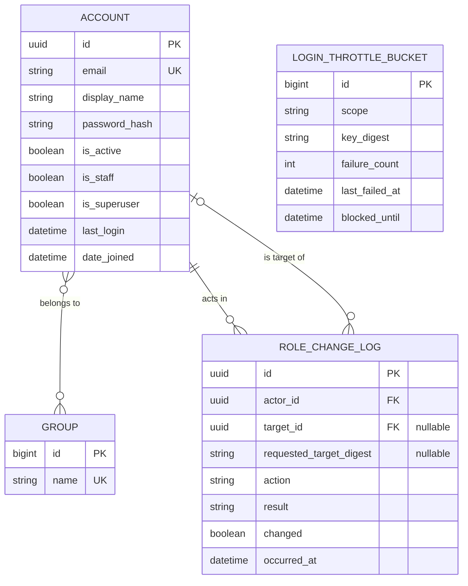
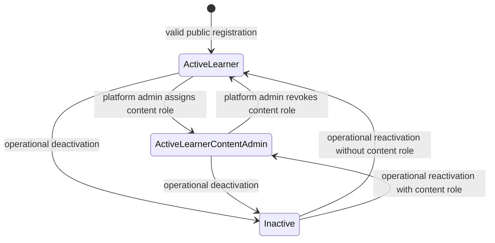

# Data Model: Autenticacion y perfil

<!-- markdownlint-disable MD060 -->

**Date**: 2026-08-20
**Spec**: [spec.md](spec.md)
**Research**: [research.md](research.md)

## Overview

El modulo `accounts` es propietario de identidad, perfil, throttling y auditoria de roles. Se reutilizan `Group`, `Permission`, `Session` y el hashing de contrasenas de Django. No existe un modelo `Profile` separado: el perfil propio es una proyeccion segura de `Account`.



## Entity: Account

Custom authentication model based on `AbstractUser`.

| Field | Type | Required | Rules |
|-------|------|----------|-------|
| `id` | UUID | Yes | Primary key generated server-side; never accepted from registration input. |
| `email` | Email string, max 254 | Yes | Canonicalized by `accounts.security.canonicalize_account_email()` as `raw.strip().casefold()` before format validation, lookup and persistence; unique; `USERNAME_FIELD`. |
| `display_name` | String, max 100 | Yes | Trimmed; 1-100 characters after trimming; editable only by the owner. |
| `password` | Django password hash | Yes | Never stores raw input; set only through `set_password()`; minimum raw length 15 and maximum form length 128. |
| `is_active` | Boolean | Yes | Defaults `True`; inactive accounts cannot authenticate. |
| `is_staff` | Boolean | Yes | Defaults `False`; operational admin access only. |
| `is_superuser` | Boolean | Yes | Defaults `False`; identifies a platform administrator and is never set by public forms. |
| `last_login` | Datetime | No | Managed by Django authentication. |
| `date_joined` | Datetime | Yes | Server timestamp at creation. |
| `groups` | Many-to-many Group | No | Contains canonical cumulative roles. Public registration always adds `learner`. |
| `user_permissions` | Many-to-many Permission | No | Not editable from profile or public role-management forms. |

`username` is removed. `first_name` and `last_name` are not used by public forms; `display_name` is the canonical profile name.

### Validation and Constraints

- Database uniqueness on canonical `email` prevents duplicate concurrent registration.
- `canonicalize_account_email()` is the sole normalization algorithm. Forms call it before format validation and lookup; `AccountManager` calls the same helper before every supported persistence path, including `create_user()` and `create_superuser()`. Application code must not persist accounts outside the manager or registration service.
- Public registration accepts only `email`, `display_name`, `password1` and `password2`.
- Password validation uses Django's configured validators; no raw password appears in logs or audit records.
- `is_staff`, `is_superuser`, `groups` and `user_permissions` are excluded from profile and registration forms.
- Foreign keys in other apps must reference `settings.AUTH_USER_MODEL`, never Django's concrete default user class.

### Derived Roles

| Role | Derivation | Assignment |
|------|------------|------------|
| `learner` | Membership in group `learner` | Added transactionally during public registration; never removed when content role changes. |
| `content_admin` | Membership in group `content_admin` | Added or removed only by the role service when actor is a platform administrator. |
| `platform_admin` | `is_active` and `is_superuser` | Provisioned operationally with `manage.py createsuperuser`; never delegated by the feature UI. |

The profile presents the derived role labels but cannot mutate their sources.

### Lifecycle



Deactivation is represented because Django authentication depends on `is_active`, but public activation/deactivation is outside this feature.

## Entity: Group (Django-owned)

Groups are seeded in `accounts/migrations/0002_seed_roles.py` with stable names.

| Name | Meaning | Initial permissions |
|------|---------|---------------------|
| `learner` | Baseline role for every public account | None in this feature; later learning permissions may be attached by their owning modules. |
| `content_admin` | Additional editorial role | None in this feature; catalog permissions are attached when catalog administration is implemented. |

The migration is idempotent through `get_or_create`. Application code imports role-name constants rather than duplicating string literals.

## Entity: LoginThrottleBucket

Persistent security state shared by all Gunicorn processes.

| Field | Type | Required | Rules |
|-------|------|----------|-------|
| `id` | Big integer | Yes | Generated primary key. |
| `scope` | Enum string | Yes | `ACCOUNT` or `ORIGIN`. |
| `key_digest` | Hex string, length 64 | Yes | HMAC-SHA256 digest; raw email and origin are never stored. |
| `failure_count` | Positive integer | Yes | Starts at 1; reset after the observation window. |
| `last_failed_at` | Datetime | Yes | Server timestamp of latest invalid attempt. |
| `blocked_until` | Datetime | Yes | Earliest next authentication evaluation time for this bucket. |

### Throttle Constraints and Indexes

- Unique constraint on (`scope`, `key_digest`).
- Check constraint `failure_count >= 1`.
- Index on (`scope`, `blocked_until`) for active-delay checks.
- Both the declared-account digest and origin digest are evaluated; effective delay is the later `blocked_until`.
- HMAC uses a dedicated salt and the project secret; changing the secret naturally invalidates old bucket lookup keys without exposing originals.

### State Transitions

```text
ABSENT --invalid attempt--> BLOCKED(failure_count=1, delay=1s)
BLOCKED --attempt before blocked_until--> BLOCKED(no credential evaluation)
BLOCKED --invalid attempt after delay--> BLOCKED(failure_count+1, delay=min(2^(n-1), 60s))
BLOCKED --15m inactivity then invalid--> BLOCKED(failure_count=1, delay=1s)
BLOCKED(account scope) --valid login--> ABSENT
BLOCKED(origin scope) --15m inactivity--> logically expired and reset on next use
```

Inactivity means `now - last_failed_at >= 15 minutes`. An attempt before that threshold continues the existing count; no worker resets rows. The first failed attempt at or after the threshold resets `failure_count` to 1 and applies a 1-second delay.

Updates use timezone-aware UTC values from `django.utils.timezone.now()`, short atomic sections and row locking. A concurrent first write relies on the unique constraint and retries the lookup after `IntegrityError`.

## Entity: RoleChangeLog

Append-only business audit record for every authenticated content-role assignment or revocation attempt, including attempts with nonexistent or malformed target identifiers.

| Field | Type | Required | Rules |
|-------|------|----------|-------|
| `id` | UUID | Yes | Generated primary key. |
| `actor` | Foreign key Account | Yes | `PROTECT`; authenticated account that submitted the operation. |
| `target` | Foreign key Account | No | Nullable `PROTECT`; existing account whose content role was addressed. Null when the requested identifier does not resolve to an account or has invalid UUID format. |
| `requested_target_digest` | Hex string, length 64 | No | HMAC-SHA256 reference to the requested identifier when `target` is null; never stores the raw value in clear text and is null when `target` exists. |
| `action` | Enum string | Yes | `ASSIGN` or `REVOKE`. |
| `result` | Enum string | Yes | `SUCCESS`, `DENIED` or `TARGET_NOT_FOUND`. |
| `changed` | Boolean | Yes | `True` only when group membership changed; repeated authorized operations are successful no-ops with `False`. |
| `occurred_at` | Datetime | Yes | Immutable server timestamp. |

### Invariants

- Exactly one log row is created per authenticated service invocation, whether the target resolves, does not exist or has invalid UUID format.
- Exactly one of `target` and `requested_target_digest` is present. Existing targets use the foreign key; nonexistent or malformed identifiers use only the digest.
- `SUCCESS` requires an active platform administrator, an existing target and actor different from target at evaluation time.
- `DENIED` covers authorization failures and every self-target attempt; it never changes group membership and `changed` must be `False`.
- `TARGET_NOT_FOUND` identifies a requested account that cannot be resolved because its UUID does not exist or its format is invalid, never changes group membership and has `changed=False`; unauthorized actors receive no observable distinction from the HTTP layer.
- Assigning an existing membership or revoking an absent membership is `SUCCESS` with `changed=False`; this makes retries idempotent while retaining evidence.
- A successful membership mutation and its `SUCCESS` log share one transaction and target-account row lock.
- Denial and target-not-found logging complete transactionally before the view returns its error response.
- Model admin is read-only. The model declares only a view default permission and exposes no update/delete service.
- Passwords, session identifiers, raw email addresses and raw origin addresses are never copied into the record.

### Constraints and Indexes

- Check constraint: exactly one of `target` and `requested_target_digest` is non-null.
- Check constraint: `result = TARGET_NOT_FOUND` if and only if `target` is null.
- Check constraint: `result IN (DENIED, TARGET_NOT_FOUND)` implies `changed = False`.
- Check constraint: `changed = True` implies `result = SUCCESS` and a non-null target.
- `SUCCESS` with `changed = False` is explicitly valid for an idempotent no-op.
- Index on (`target`, `occurred_at`) for account history.
- Index on (`requested_target_digest`, `occurred_at`) for correlation of unresolved-target attempts.
- Index on (`actor`, `occurred_at`) for administrative review.
- Index on (`result`, `occurred_at`) for denied-attempt monitoring.

## Entity: Session (Django-owned)

Django database-backed sessions store only the authenticated account identifier, backend and session authentication hash in the normal framework format.

### Rules

- Login rotates the session key and attaches the authenticated account through Django `login()`.
- Logout is POST-only and calls Django `logout()`, which clears all current session data; repeated logout remains safe.
- Private views require both a valid authenticated session and `request.user.is_active`. A session whose account was deactivated is logged out on its next private request and redirected to login without revealing account state.
- Production cookies remain `Secure`; CSRF middleware protects all state-changing forms.
- Session expiry follows Django's project setting. Password-change and recovery flows are outside this feature.

## Service Boundaries

| Service | Inputs | Output | Transaction boundary |
|---------|--------|--------|----------------------|
| `register_account` | Canonical email, display name, validated raw password | New active learner Account | Account insert + learner group membership |
| `evaluate_login_throttle` | Declared email, trusted request origin, current time | Allowed or retry-after duration | Locks relevant buckets |
| `record_login_failure` | Account/origin digests, current time | Effective retry-after duration | Upserts and locks both buckets |
| `record_login_success` | Account digest | None | Deletes account bucket |
| `change_content_role` | Actor, requested target reference, ASSIGN/REVOKE | Result and changed flag | One atomic service call: parse the UUID, resolve and lock an existing target, enforce actor/target authorization, mutate membership only for authorized success, and create exactly one success, denial or target-not-found log, including malformed references |

Views and templates may call these interfaces but must not reimplement their rules.

## Migration Order

1. Set `AUTH_USER_MODEL = "accounts.Account"` in settings.
2. `accounts/0001_initial`: create Account, LoginThrottleBucket and RoleChangeLog; this must be the app's first migration.
3. `accounts/0002_seed_roles`: create `learner` and `content_admin` groups idempotently.
4. Run standard Django auth/contenttypes/session migrations in the dependency order generated by Django.

Changing `AUTH_USER_MODEL` after production tables exist is explicitly out of scope and must not be deferred beyond this feature.
