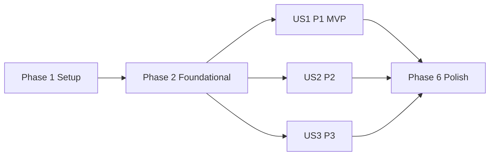

# Tasks: Autenticacion y perfil

**Input**: Design documents from `specs/002-user-auth-profile/`

**Prerequisites**: `plan.md`, `spec.md`, `research.md`, `data-model.md`, `contracts/web-auth.md`, `quickstart.md`

**Tests**: La especificacion y la constitucion exigen pruebas automatizadas de autenticacion, permisos, aislamiento entre sesiones, concurrencia, throttling y auditoria de todos los intentos autenticados. En cada historia, escribir las pruebas indicadas y comprobar que fallan antes de implementar.

**Organization**: Las tareas se agrupan por historia de usuario para permitir implementacion y validacion independientes.

## Format: `[ID] [P?] [Story] Description`

- **[P]**: Puede ejecutarse en paralelo porque usa archivos distintos y no depende de una tarea incompleta.
- **[Story]**: Historia de usuario asociada (`US1`, `US2` o `US3`).
- Todas las tareas incluyen rutas exactas del repositorio.

## Phase 1: Setup (Shared Infrastructure)

**Purpose**: Preparar paquetes, rutas y presentacion compartida sin rehacer la linea base Django existente.

- [X] T001 Crear los paquetes `accounts/services/__init__.py`, `accounts/migrations/__init__.py`, `tests/accounts/__init__.py` y `tests/ui/__init__.py`, y los directorios `ui/templates/accounts/` y `ui/templates/ui/`
- [X] T002 [P] Crear el layout server-rendered accesible con mensajes, resumen de errores y bloques de navegacion/contenido en `ui/templates/base.html`
- [X] T003 Crear los namespaces vacios `accounts/urls.py` y `ui/urls.py` e incluirlos desde `kronolearn/urls.py` sin alterar `/admin/` ni `/healthz`

---

## Phase 2: Foundational (Blocking Prerequisites)

**Purpose**: Establecer identidad, persistencia y configuracion compartidas por las tres historias.

**CRITICAL**: Ninguna historia de usuario puede implementarse hasta completar esta fase y aplicar sus migraciones sobre PostgreSQL.

- [X] T004 [P] Escribir primero pruebas fallidas del modelo `Account`, manager, canonicalizacion, UUID, unicidad y constraints de throttling y auditoria, incluido el XOR entre objetivo y digest y `TARGET_NOT_FOUND` para toda referencia no resuelta, en `tests/accounts/test_models.py`
- [X] T005 [P] Escribir primero pruebas fallidas de `AUTH_USER_MODEL`, politica minima de 15 caracteres y migracion idempotente de grupos `learner`/`content_admin` en `tests/accounts/test_configuration.py`
- [X] T006 Implementar `canonicalize_account_email()`, nombres canonicos de roles y utilidades HMAC-SHA256 con propositos/salts separados para throttling y referencias de objetivo inexistentes o malformadas, firmando el UUID canonico cuando sea valido y el segmento recibido cuando sea invalido, sin registrar valores solicitados en claro, en `accounts/security.py`
- [X] T007 Implementar `AccountManager` para canonicalizar todos los caminos soportados de `create_user()` y `create_superuser()` en `accounts/managers.py`
- [X] T008 Implementar `Account`, `LoginThrottleBucket` y `RoleChangeLog` con `target` nullable, `requested_target_digest`, resultados `SUCCESS`/`DENIED`/`TARGET_NOT_FOUND`, indices, constraints XOR y relaciones definidos en `accounts/models.py`
- [X] T009 Configurar `AUTH_USER_MODEL`, URLs de autenticacion y `MinimumLengthValidator` con longitud 15 en `kronolearn/settings/base.py`
- [X] T010 Crear la migracion inicial de los tres modelos y la migracion idempotente de grupos en `accounts/migrations/0001_initial.py` y `accounts/migrations/0002_seed_roles.py`

**Checkpoint**: `manage.py check`, las pruebas fundacionales y `manage.py migrate` pasan sobre PostgreSQL; `accounts.Account` es el modelo activo y ambos grupos existen.

---

## Phase 3: User Story 1 - Crear una cuenta e iniciar sesion (Priority: P1) - MVP

**Goal**: Permitir registro seguro con rol de aprendiz, login con throttling compartido y retorno seguro al inicio o a una ruta privada autorizada.

**Independent Test**: Una persona sin cuenta se registra con correo, nombre visible y contrasena, recibe solo `learner`, inicia sesion y llega a `/learn/`; duplicados, credenciales invalidas, throttling y destinos inseguros se rechazan sin revelar si la cuenta existe.

### Tests for User Story 1

- [X] T011 [P] [US1] Escribir pruebas de registro valido/invalido, canonicalizacion, rol inicial, rollback y carrera PostgreSQL del mismo correo en `tests/accounts/test_registration.py`
- [X] T012 [P] [US1] Escribir pruebas `TransactionTestCase` del throttling por cuenta/origen, HMAC, progresion 1-60 s, ventana de 15 min, concurrencia y reset tras exito en `tests/accounts/test_throttling.py`
- [X] T013 [P] [US1] Escribir pruebas de login con estados `303` para exito, `200` para credenciales invalidas, `429` y `Retry-After` para espera activa, mensaje generico equivalente y `next` interno/autorizado con fallback seguro en `tests/accounts/test_sessions.py`
- [X] T014 [P] [US1] Escribir pruebas del inicio minimo del aprendiz para sesion activa y rechazo de acceso anonimo en `tests/ui/test_learner_home.py`

### Implementation for User Story 1

- [X] T015 [P] [US1] Implementar `register_account()` atomico con membresia `learner` y traduccion externa de `IntegrityError` sin reintentar la insercion en `accounts/services/registration.py`
- [X] T016 [P] [US1] Implementar `evaluate_login_throttle()`, `record_login_failure()` y `record_login_success()` con bloqueo, upsert concurrente, progresion 1-60 s, ventana de 15 min, concurrencia y reset tras exito en `accounts/services/throttling.py`
- [X] T017 [US1] Implementar `RegistrationForm` y `ThrottledAuthenticationForm` con campos permitidos, validadores Django y mensajes genericos en `accounts/forms.py`
- [X] T018 [US1] Implementar `resolve_safe_next()` con same-origin, mapa inmutable de nombres de URL y predicados por actor activo en `accounts/security.py`
- [X] T019 [US1] Implementar vistas server-rendered de registro y login con CSRF, PRG 303, sesion Django, mensaje contractual `No fue posible iniciar sesion con los datos proporcionados.` y eventos estructurados `accounts.login.succeeded`/`accounts.login.failed` sin secretos en `accounts/views.py`
- [X] T020 [US1] Publicar `accounts:register` y `accounts:login` con sus metodos y nombres contractuales en `accounts/urls.py`
- [X] T021 [P] [US1] Crear formularios accesibles de registro y login, sin reimprimir contrasenas ni depender de JavaScript, en `ui/templates/accounts/register.html` y `ui/templates/accounts/login.html`
- [X] T022 [P] [US1] Implementar la vista, ruta `ui:learner-home` y pagina privada minima en `ui/views.py`, `ui/urls.py` y `ui/templates/ui/learner_home.html`

**Checkpoint**: US1 funciona de extremo a extremo y pasa `tests.accounts.test_registration`, `tests.accounts.test_throttling`, los casos de login de `tests.accounts.test_sessions` y `tests.ui.test_learner_home`.

---

## Phase 4: User Story 2 - Proteger la sesion y el perfil propio (Priority: P2)

**Goal**: Exponer solo el perfil de `request.user`, permitir cambiar unicamente `display_name` y cerrar/inutilizar la sesion de forma segura e idempotente.

**Independent Test**: Con dos cuentas y dos clientes autenticados independientes, cada sesion ve y modifica solo su perfil aunque aporte el `account_id` de la otra; identificadores y campos privilegiados se ignoran, logout POST invalida acceso, GET devuelve 405 y una cuenta desactivada pierde acceso privado.

### Tests for User Story 2

- [X] T023 [P] [US2] Escribir pruebas con dos clientes autenticados para perfil propio, aislamiento entre cuentas, `account_id`/`user_id` adicionales ignorados en query y POST, edicion exclusiva de `display_name` y descarte de campos privilegiados en `tests/accounts/test_profile.py`
- [X] T024 [P] [US2] Extender pruebas de sesion con rutas privadas, expiracion, cuenta desactivada, logout POST idempotente, CSRF y logout GET 405 en `tests/accounts/test_sessions.py`

### Implementation for User Story 2

- [X] T025 [P] [US2] Implementar `ProfileForm` limitado a `display_name`, con trim y longitud 1-100, en `accounts/forms.py`
- [X] T026 [P] [US2] Implementar el guard compartido de cuenta autenticada activa que cierra sesiones desactivadas sin revelar estado en `accounts/security.py`
- [X] T027 [US2] Implementar perfil GET/POST basado solo en `request.user` y logout POST idempotente con PRG 303, reutilizando el guard activo en `accounts/views.py` y `ui/views.py`
- [X] T028 [US2] Publicar `accounts:profile` y `accounts:logout` sin identificadores de cuenta en `accounts/urls.py`
- [X] T029 [US2] Crear la pagina de perfil y completar navegacion/logout mediante formulario POST en `ui/templates/accounts/profile.html` y `ui/templates/base.html`

**Checkpoint**: US2 pasa de forma independiente usando fixtures de cuenta, sin requerir el formulario de registro ni exponer identificadores de perfiles ajenos.

---

## Phase 5: User Story 3 - Administrar roles de contenido (Priority: P3)

**Goal**: Permitir solo a un administrador de plataforma asignar o retirar `content_admin` a otra cuenta, conservar `learner` y auditar exactamente una vez cada intento autenticado, incluidos autoobjetivos e identificadores inexistentes o malformados.

**Independent Test**: Con cuentas fixture de plataforma, aprendiz y administrador de contenido, solo la primera cambia el rol de otra cuenta; operaciones repetidas son no-op exitoso, autoobjetivos y actores sin autoridad se deniegan, UUID inexistentes y referencias malformadas no crean cuentas y dejan `TARGET_NOT_FOUND` con digest, el administrador de plataforma recibe `404`, los demas actores `403` generico y cada intento autenticado deja exactamente un registro inmutable completo.

### Tests for User Story 3

- [X] T030 [P] [US3] Escribir pruebas transaccionales del servicio para autoridad, actor distinto de objetivo, conservacion de `learner`, idempotencia, bloqueo concurrente y una auditoria exacta `SUCCESS`/`DENIED`/`TARGET_NOT_FOUND`, usando relacion para objetivo existente, digest del UUID canonico inexistente o digest del segmento malformado y nunca ambos, en `tests/accounts/test_roles.py`
- [X] T031 [P] [US3] Escribir pruebas contractuales de listado, busqueda ORM, assign/revoke POST CSRF-only, anonimo 302 sin auditoria, autoobjetivo 403 y las cuatro combinaciones de administrador/actor no autorizado con UUID inexistente/referencia malformada que producen 404/403 y una auditoria por intento autenticado en `tests/accounts/test_role_views.py`
- [X] T032 [P] [US3] Escribir pruebas de admin de `RoleChangeLog` solo lectura, representacion segura de objetivo nullable/digest y ausencia de permisos de alta, cambio o borrado en `tests/accounts/test_admin.py`

### Implementation for User Story 3

- [X] T033 [P] [US3] Implementar `change_content_role(actor, target_ref, action)` como unica frontera para parsear UUID, resolver y bloquear objetivos existentes, denegar autoobjetivo o falta de autoridad y registrar exactamente una auditoria antes de retornar; usar `TARGET_NOT_FOUND` con digest para UUID inexistente o referencia malformada, nunca persistir ni registrar el raw target, emitir `accounts.role_change.succeeded`/`denied`/`target_not_found` y realizar mutacion atomica solo en exito, en `accounts/services/roles.py`
- [X] T034 [P] [US3] Implementar `RoleSearchForm` con campo `q` opcional y longitud limitada para busqueda ORM; no aceptar campos de accion porque assign/revoke reciben solo CSRF y derivan la accion de la ruta, en `accounts/forms.py`
- [X] T035 [US3] Implementar listado paginado y vistas POST autenticadas de assign/revoke que pasen `target_ref` sin parsear ni resolver al servicio, sin cortocircuito de superusuario, y mapear `SUCCESS`/`DENIED`/`TARGET_NOT_FOUND` a 303/403/404 segun el actor, en `accounts/views.py`
- [X] T036 [US3] Publicar `accounts:role-management` y las rutas assign/revoke con `<str:target_ref>` para que UUID inexistentes y referencias malformadas alcancen la vista autenticada en `accounts/urls.py`
- [X] T037 [P] [US3] Crear la tabla accesible de cuentas/roles y formularios CSRF de asignacion y retirada en `ui/templates/accounts/role_management.html`
- [X] T038 [P] [US3] Registrar `Account` y la auditoria inmutable de solo lectura, mostrando de forma segura objetivo existente o referencia pseudonima sin permitir alta, cambio o borrado, en `accounts/admin.py`

**Checkpoint**: US3 pasa con fixtures y conserva identidad/rol `learner`; cada intento autenticado genera una auditoria, los UUID inexistentes y referencias malformadas no crean identidades ni se guardan en claro, solo el administrador de plataforma observa `404` y ninguna cuenta puede cambiar su propio rol mediante esta interfaz.

---

## Phase 6: Polish & Cross-Cutting Concerns

**Purpose**: Cerrar seguridad transversal, CI, documentacion de cambio y evidencia de aceptacion.

- [X] T039 [P] Agregar cobertura transversal de CSRF, PRG 303, accesibilidad basica y ausencia de secretos, datos privados o referencias de objetivo sin digerir en respuestas, logs y auditorias en `tests/accounts/test_security.py`
- [X] T040 Integrar Ruff, checks Django, drift de migraciones, suite completa y PostgreSQL en `.github/workflows/ci.yml` preservando las puertas de la linea base
- [X] T041 [P] Documentar el cambio publico y la migracion inicial obligatoria de `AUTH_USER_MODEL` en `CHANGELOG.md` y `specs/002-user-auth-profile/quickstart.md`
- [ ] T042 Ejecutar todos los comandos y los nueve escenarios de `specs/002-user-auth-profile/quickstart.md`, siguiendo Scenario 9 para el protocolo unico de diez participantes sin asistencia con `>=9/10` registros/login en `<180 s` y `>=9/10` identificaciones correctas de ambos estados de sesion; conservar solo evidencia agregada, mantener esta feature sin gate de latencia/carga y corregir cualquier diferencia frente a `specs/002-user-auth-profile/contracts/web-auth.md`

---

## Dependencies and Execution Order

### Phase Dependencies

- **Phase 1 (Setup)**: Puede comenzar inmediatamente.
- **Phase 2 (Foundational)**: Depende de Phase 1 y bloquea todas las historias.
- **US1 (P1)**: Depende solo de Phase 2 y constituye el MVP recomendado.
- **US2 (P2)**: Depende solo de Phase 2 para pruebas con fixtures; se entrega despues de US1 por prioridad y comparte archivos de integracion.
- **US3 (P3)**: Depende solo de Phase 2 para pruebas con fixtures; se entrega despues de US2 por prioridad y comparte formularios, vistas y rutas.
- **Phase 6 (Polish)**: Depende de completar US1, US2 y US3.



### Within Each User Story

- Escribir las pruebas de la historia y comprobar su fallo antes de implementar.
- Implementar primero servicios/reglas de dominio, luego forms/views, despues rutas/templates.
- Ejecutar el subconjunto de pruebas de la historia en cada checkpoint.
- No duplicar autorizacion, throttling ni reglas de roles en vistas o templates.

### Detailed Dependencies

- T007 depende de T006; T008 depende de T007; T009 debe completar `AUTH_USER_MODEL` despues de T008 y antes de generar T010; T010 cierra la primera migracion intercambiable y los grupos iniciales.
- T015 y T016 pueden avanzar en paralelo despues de T011-T014; T017 depende de ambos servicios; T019 depende de T017 y T018; T020 depende de T019.
- T025 y T026 pueden avanzar en paralelo despues de T023-T024; T027 depende de ambas; T028 depende de T027.
- T033, T034 y T038 pueden avanzar en paralelo despues de T030-T032; T035 depende de T033-T034; T036 depende de T035 y debe conservar el transporte textual de `target_ref`.
- La integracion de archivos compartidos respeta `T017 -> T025 -> T034` en `accounts/forms.py`, `T019 -> T027 -> T035` en `accounts/views.py`, `T020 -> T028 -> T036` en `accounts/urls.py` y `T006/T018 -> T026` en `accounts/security.py`; las historias pueden probarse con fixtures, pero estos cambios se fusionan en orden US1, US2 y US3.
- T040-T042 se ejecutan cuando todos los checkpoints de historia estan verdes.

## Parallel Execution Examples

### User Story 1

```text
Parallel tests: T011 registration | T012 throttling | T013 login/redirect | T014 learner home
Parallel domain work after red tests: T015 registration service | T016 throttling service
Parallel presentation work: T021 account templates | T022 learner-home files
```

### User Story 2

```text
Parallel tests: T023 two-session profile isolation and ignored identifiers | T024 session/logout
Parallel implementation after red tests: T025 profile form | T026 active-account guard
```

### User Story 3

```text
Parallel tests: T030 role service and valid/malformed digest states | T031 role views and 404/403 response parity | T032 read-only admin
Parallel implementation after red tests: T033 role service | T034 search form | T038 admin registration
```

## Implementation Strategy

### MVP First

1. Completar Phase 1 y Phase 2.
2. Implementar solo US1 (T011-T022).
3. Validar registro, rol `learner`, login, throttling y retorno seguro de extremo a extremo.
4. Entregar el MVP antes de incorporar perfil y administracion de roles.

### Incremental Delivery

1. **Foundation**: modelo intercambiable, persistencia, grupos y configuracion.
2. **US1**: entrada segura y experiencia minima autenticada.
3. **US2**: privacidad de perfil y cierre de sesion.
4. **US3**: delegacion editorial auditada.
5. **Polish**: seguridad transversal, CI, changelog y quickstart completo.

## Task Summary

- **Total tasks**: 42
- **Setup**: 3 tasks
- **Foundational**: 7 tasks
- **US1**: 12 tasks
- **US2**: 7 tasks
- **US3**: 9 tasks
- **Polish**: 4 tasks
- **Parallel opportunities**: 24 tasks marked `[P]`
- **Suggested MVP**: Phase 1 + Phase 2 + User Story 1 (T001-T022)

**Final checkpoint**: Los 42 tasks terminan cuando T042 confirma que CI, la suite PostgreSQL y los nueve escenarios de `quickstart.md`, incluido el protocolo representativo 9/10, cumplen el contrato sin evidencia sensible y sin convertir una cifra de latencia no sustentada en gate.

## Phase 7: Convergence

- [X] T043 **CRITICAL** Restaurar la puerta de formato de CI aplicando Ruff a `accounts/migrations/0003_loginthrottlebucket_last_failed_index.py`, `accounts/services/throttling.py` y `tests/accounts/test_admin.py`, y confirmar `ruff check .` y `ruff format --check .` en verde per Constitution 7 / T040 (contradicts)
- [X] T044 Hacer inmutable `SAFE_RETURN_ROUTES` en `accounts/security.py` y agregar una prueba que impida modificar la allowlist de destinos autorizados en `tests/accounts/test_sessions.py` per FR-007 / plan: decision 7 / T018 (partial)
- [X] T045 Evaluar y bloquear la autoridad vigente del actor dentro de `change_content_role()` para objetivos existentes, inexistentes y malformados, transportar esa decision al mapeo HTTP sin depender del `request.user` obsoleto, y cubrir revocacion concurrente de autoridad con auditoria exacta y respuestas 403/404 en `tests/accounts/test_roles.py` y `tests/accounts/test_role_views.py` per FR-013 / FR-015 (partial)
- [X] T046 Refactorizar el flujo de login para subclasificar `AuthenticationForm` y `LoginView` de Django, preservando serializacion del throttling, respuesta generica, `Retry-After`, PRG 303 y `next` autorizado en `accounts/forms.py`, `accounts/views.py` y sus pruebas per plan: decision 6 (partial)
- [X] T047 Comunicar antes del envio la politica minima de contrasena de 15 caracteres mediante ayuda accesible asociada al campo y verificarla en la respuesta de registro en `accounts/forms.py`, `ui/templates/accounts/register.html` y `tests/accounts/test_security.py` per US1/AC1 (partial)
