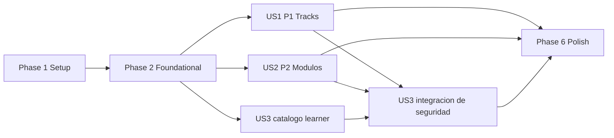

# Tasks: Administracion de tracks y modulos

**Input**: Design documents from `specs/003-manage-tracks-modules/`

**Prerequisites**: `plan.md`, `spec.md`, `research.md`, `data-model.md`, `contracts/web.md`, `quickstart.md`

**Tests**: La especificacion y la constitucion exigen pruebas automatizadas de permisos, publicacion/versionado, ordenamiento, concurrencia, visibilidad activa, inmutabilidad y auditoria. En cada historia, escribir las pruebas indicadas y comprobar que fallan antes de implementar.

**Organization**: Las tareas se agrupan por historia de usuario para permitir implementacion y validacion independientes. La checklist `checklists/security-versioning.md` pertenece al revisor; generar estas tareas no modifica sus marcadores.

## Format: `[ID] [P?] [Story] Description`

- **[P]**: Puede ejecutarse en paralelo porque usa archivos distintos y no depende de una tarea incompleta.
- **[Story]**: Historia de usuario asociada (`US1`, `US2` o `US3`); solo aparece en fases de historia.
- **[ID]**: Identificador secuencial `T001..T043` en orden de ejecucion.
- Todas las tareas incluyen rutas exactas del repositorio.

## Phase 1: Setup (Shared Infrastructure)

**Purpose**: Preparar paquetes, namespace y directorios del catalogo sin agregar dependencias ni alterar rutas existentes.

- [X] T001 Crear `catalog/services/__init__.py`, `catalog/migrations/__init__.py`, `tests/catalog/__init__.py` y los directorios `templates/catalog/partials/` para la implementacion y sus pruebas
- [X] T002 Crear el namespace inicial `catalog/urls.py` con `app_name = "catalog"` e incluirlo desde `kronolearn/urls.py` sin modificar los contratos existentes de `/admin/`, `/healthz`, `/accounts/` y `/learn/`

---

## Phase 2: Foundational (Blocking Prerequisites)

**Purpose**: Establecer persistencia, constraints, resultados de dominio, auditoria e historial inmutable compartidos por las tres historias.

**CRITICAL**: Ninguna historia puede implementarse hasta completar esta fase y aplicar `catalog/migrations/0001_initial.py` sobre PostgreSQL.

- [X] T003 [P] Escribir primero pruebas fallidas de UUID, defaults, normalizacion `title.strip().casefold()`, relaciones `PROTECT`, posiciones, revisiones, estados e indices/constraints, incluida la exclusion mutua entre `entity_id` y `unresolved_reference_digest`, de `CatalogState`, `Track`, `Module`, `TrackVersion`, `ModuleVersion` y `CatalogChangeLog` en `tests/catalog/test_models.py`
- [X] T004 [P] Escribir primero pruebas fallidas de snapshots/auditoria append-only, HMAC-SHA256 determinista sin valor crudo para referencias no resueltas, exactamente un registro por comando de servicio y permisos de solo consulta en `tests/catalog/test_content_services.py` y `tests/catalog/test_admin.py`
- [X] T005 Implementar `CatalogState`, `Track` y `Module` con enums, UUID, limites 160/2000/500/1000, `title_key`, posiciones, revisiones, estados, timestamps, orden, indices y constraints definidos en `specs/003-manage-tracks-modules/data-model.md` dentro de `catalog/models.py`
- [X] T006 Implementar `TrackVersion`, `ModuleVersion` y `CatalogChangeLog` con secuencias por elemento, fuente libre normalizada hasta 500 caracteres, metadata `APPROVED`, `unresolved_reference_digest`, constraints de resultado/cambio y referencia exclusiva, relaciones `PROTECT` e inmutabilidad en `catalog/models.py`
- [X] T007 Crear `catalog/migrations/0001_initial.py` con los seis modelos, constraints e indices, incluido `(entity_type, unresolved_reference_digest, occurred_at)`, y una operacion idempotente que inserte `CatalogState(id=1, track_order_revision=0)`
- [X] T008 [P] Implementar en `catalog/services/content.py` el resultado inmutable `CatalogCommandOutcome`, resolucion/autorizacion de referencias opacas, `field_errors` y auditoria exactamente-una-vez de `SUCCESS`, `DENIED`, `INVALID`, `CONFLICT` y `NOT_FOUND`, usando `salted_hmac(..., algorithm="sha256")` con proposito dedicado para referencias no resueltas y sin persistir payloads ni valores crudos
- [X] T009 [P] Registrar `TrackVersion`, `ModuleVersion` y `CatalogChangeLog` como consultas protegidas de solo lectura, sin permisos de alta, cambio o borrado, en `catalog/admin.py`

**Checkpoint**: `manage.py check`, `makemigrations --check --dry-run`, migracion PostgreSQL y `tests.catalog.test_models`/`tests.catalog.test_admin` pasan; el singleton existe y el historial no admite mutacion.

---

## Phase 3: User Story 1 - Administrar tracks (Priority: P1)

**Goal**: Permitir que un administrador de contenido cree, edite, ordene, active y desactive tracks con validacion atomica, version publicada y auditoria.

**Independent Test**: Con cuentas fixture y un modulo activo preexistente, un administrador crea y ordena dos tracks, acepta fuente URL/documental, activa, repite la activacion sin version, desactiva y reactiva creando la siguiente version; una repeticion con revision obsoleta retorna conflicto, cada comando alcanzado queda auditado y un aprendiz no accede a las rutas.

### Tests for User Story 1

- [X] T010 [P] [US1] Escribir pruebas fallidas de `create_track()`, `edit_track()` y `change_track_status()` para permisos, trim/limites, fuente URL o documental, titulo global unico, campos protegidos, revision validada antes del no-op, metadata obligatoria/no futura, requisito de modulo activo, version nueva en cada reactivacion real, activacion/desactivacion idempotente vigente, secuencia `TrackVersion` concurrente y auditoria de todos los resultados en `tests/catalog/test_content_services.py`
- [X] T011 [P] [US1] Escribir pruebas fallidas de `move_track()` para primera/intermedia/ultima posicion, rango invalido, secuencia sin huecos, incremento de revisiones, rollback y conflictos de `track_order_revision`, incluidos casos `TransactionTestCase` con conexiones PostgreSQL independientes en `tests/catalog/test_ordering_services.py`
- [X] T012 [P] [US1] Escribir pruebas contractuales fallidas de listado, alta, edicion, activar/desactivar y reordenar tracks para sesion/rol, CSRF, campos extra, fuente libre, UUID inexistente/malformado auditado sin valor crudo, revision obsoleta aunque el estado coincida, 303/200/403/404/409, HTML y fragmento HTMX permitido en `tests/catalog/test_admin_views.py`

### Implementation for User Story 1

- [X] T013 [P] [US1] Implementar `TrackForm`, `PublicationMetadataForm` y `TrackPositionForm` con whitelist, trim, limites, fuente como texto libre no vacio hasta 500 caracteres sin exigir URL, fecha ISO no futura, `APPROVED`, `expected_revision` y `expected_order_revision` en `catalog/forms.py`
- [X] T014 [P] [US1] Implementar `list_tracks_for_admin()` y `get_track_for_admin()` con orden `(position, id)`, estados completos y tokens de revision solo para actores autorizados en `catalog/services/queries.py`
- [X] T015 [P] [US1] Implementar `create_track()`, `edit_track()` y `change_track_status()` con `transaction.atomic()`, bloqueos estables, revalidacion de `CONTENT_ADMIN_ROLE`, revision comprobada antes de idempotencia, traduccion externa de `IntegrityError`, snapshot en cada reactivacion real y edicion activa, ningun snapshot en no-op vigente y auditoria exacta en `catalog/services/content.py`
- [X] T016 [P] [US1] Implementar `move_track()` con bloqueo de `CatalogState` y tracks por UUID, revision de orden, validacion `1..N`, desplazamiento temporal positivo, posiciones finales consecutivas y rollback/auditoria atomicos en `catalog/services/ordering.py`
- [X] T017 [US1] Implementar vistas delgadas de lista, alta, edicion, activacion, desactivacion y posicion de tracks con `active_account_required`, mapeo de resultados, PRG 303, errores 200, conflicto 409 y fragmento HTMX allowlisted en `catalog/views.py`
- [X] T018 [US1] Publicar `catalog:manage-track-list`, `catalog:manage-track-create`, `catalog:manage-track-edit`, `catalog:manage-track-activate`, `catalog:manage-track-deactivate` y `catalog:manage-track-reorder` con `<str:track_ref>` en `catalog/urls.py`
- [X] T019 [P] [US1] Crear lista y formulario accesibles de tracks y el fragmento HTMX de filas, con CSRF, revisiones ocultas, metadata condicional, mensajes/errores y operacion completa sin JavaScript, en `templates/catalog/manage_track_list.html`, `templates/catalog/manage_track_form.html` y `templates/catalog/partials/track_rows.html`

**Checkpoint**: US1 pasa con fixtures de cuenta y modulo activo sin requerir la interfaz de modulos; conserva orden, versiones y auditoria y no expone datos a actores sin rol.

---

## Phase 4: User Story 2 - Administrar modulos de un track (Priority: P2)

**Goal**: Permitir crear, editar, ordenar, activar y desactivar modulos dentro de un track sin trasladarlos, dejar huecos ni romper una ruta activa.

**Independent Test**: Con un track fixture, un administrador crea, edita y ordena tres modulos, publica con fuente URL/documental, verifica no-op vigente, conflicto no-op obsoleto y nueva version al reactivar; la secuencia queda consecutiva, el titulo puede repetirse en otro track y no se desactiva el ultimo modulo activo de un track activo.

### Tests for User Story 2

- [X] T020 [P] [US2] Extender pruebas fallidas de servicio con `create_module()`, `edit_module()` y `change_module_status()` para padre derivado, titulo unico por track, campos extra, fuente URL/documental, revision obsoleta prevaleciendo sobre no-op, metadata/version por modulo, version nueva en cada reactivacion, activacion bajo track inactivo, estados idempotentes vigentes e invariante del ultimo modulo activo en `tests/catalog/test_content_services.py`
- [X] T021 [P] [US2] Extender pruebas fallidas de `move_module()` para extremos/centro, rango, pertenencia, orden relativo, revisiones, rollback y carreras PostgreSQL sobre `module_order_revision` dentro de `tests/catalog/test_ordering_services.py`
- [X] T022 [P] [US2] Extender pruebas contractuales con listado, alta, edicion, activar/desactivar y reordenar modulos para referencias padre-hijo inexistentes/malformadas auditadas solo con digest, CSRF, campos protegidos, revision obsoleta aunque el estado coincida, 303/200/403/404/409 y respuesta HTMX allowlisted en `tests/catalog/test_admin_views.py`

### Implementation for User Story 2

- [X] T023 [P] [US2] Implementar `ModuleForm` y `ModulePositionForm` limitados a titulo/objetivo y posicion/revision esperada, reutilizando metadata editorial sin aceptar track, estado, autor, posicion en edicion ni numero de version en `catalog/forms.py`
- [X] T024 [P] [US2] Implementar `list_modules_for_admin()` y `get_module_for_admin()` validando la relacion con el track y ordenando por `(position, id)` con `module_order_revision` en `catalog/services/queries.py`
- [X] T025 [P] [US2] Implementar `create_module()`, `edit_module()` y `change_module_status()` con bloqueos de actor/track/modulos, revision antes de idempotencia, posicion final, padre inmutable, snapshot por modulo en cada reactivacion real y edicion activa, invariante de ruta activa y auditoria atomica en `catalog/services/content.py`
- [X] T026 [P] [US2] Implementar `move_module()` con bloqueo estable del track y sus modulos, revision de orden, rango `1..N`, desplazamiento temporal positivo y secuencia consecutiva sin afectar otros tracks en `catalog/services/ordering.py`
- [X] T027 [US2] Implementar vistas delgadas de lista, alta, edicion, activacion, desactivacion y posicion de modulos, pasando referencias opacas a servicios y traduciendo resultados sin revelar existencia a actores no autorizados, en `catalog/views.py`
- [X] T028 [US2] Publicar las seis rutas `catalog:manage-module-*` bajo `/catalog/manage/tracks/<str:track_ref>/modules/` con `<str:module_ref>` cuando aplique en `catalog/urls.py`
- [X] T029 [P] [US2] Crear lista y formulario accesibles de modulos y fragmento HTMX de filas, con CSRF, revisiones, metadata condicional, estado/orden visibles y flujo completo sin JavaScript, en `templates/catalog/manage_module_list.html`, `templates/catalog/manage_module_form.html` y `templates/catalog/partials/module_rows.html`

**Checkpoint**: US2 pasa con un track fixture, mantiene titulo/orden por padre, versiones por elemento e invariante activa; junto con US1 permite publicar una ruta completa desde una base vacia.

---

## Phase 5: User Story 3 - Explorar una ruta activa de forma segura (Priority: P3)

**Goal**: Mostrar a cuentas activas solo tracks activos y modulos activos bajo tracks activos, en orden, y denegar toda superficie administrativa al aprendiz sin divulgacion.

**Independent Test**: Con una matriz fixture de estados, el aprendiz ve solo la jerarquia activa ordenada; referencias inexistentes, inactivas, malformadas o padre-hijo incorrectas reciben el mismo 404, mientras GET/POST administrativo devuelve 403 sin mutacion ni datos privados, el POST autenticado que supera CSRF genera un unico `DENIED` y los intentos detenidos antes del servicio no generan auditoria.

### Tests for User Story 3

- [X] T030 [P] [US3] Escribir pruebas fallidas de consultas para lista/detalle activos, prefetch filtrado, orden, numero acotado de queries y proyecciones sin `title_key`, revisiones, metadata, versiones ni auditoria en `tests/catalog/test_queries.py`
- [X] T031 [P] [US3] Escribir pruebas contractuales fallidas de `catalog:track-list`, `catalog:track-detail` y `catalog:module-detail` para sesion activa, orden, acceso directo, combinacion padre-hijo y equivalencia 404 entre contenido inexistente/inactivo en `tests/catalog/test_learner_views.py`
- [X] T032 [P] [US3] Completar pruebas de no divulgacion para GET/POST administrativo del aprendiz, ausencia de mutacion, exactamente una auditoria `DENIED` solo cuando el POST autenticado supera CSRF y alcanza servicio, cero auditorias antes de servicio y allowlist inmutable de `next` para rutas learner/admin en `tests/catalog/test_admin_views.py` y `tests/accounts/test_sessions.py`

### Implementation for User Story 3

- [X] T033 [P] [US3] Implementar `list_active_tracks()`, `get_active_track()` y `get_active_module()` con filtros de estado/parentesco previos a proyectar, orden `(position, id)` y prefetch exclusivo de modulos activos en `catalog/services/queries.py`
- [X] T034 [US3] Implementar vistas de catalogo del aprendiz con `active_account_required`, contexto minimo y 404 generico, y publicar las tres rutas GET contractuales con referencias opacas `<str:...>` analizadas dentro de consultas autorizadas en `catalog/views.py` y `catalog/urls.py`
- [X] T035 [P] [US3] Crear lista y detalle accesibles del aprendiz con solo titulo, descripcion, audiencia, objetivo y orden permitidos en `templates/catalog/learner_track_list.html` y `templates/catalog/learner_track_detail.html`
- [X] T036 [US3] Enlazar el catalogo desde `templates/ui/learner_home.html` y extender el mapa inmutable/predicados de `resolve_safe_next()` para rutas learner y administrativas autorizadas en `accounts/security.py`

**Checkpoint**: US3 pasa con fixtures sin depender de formularios administrativos; la siguiente solicitud deja de exponer contenido desactivado y ningun caso 404/403 revela datos editoriales.

---

## Phase 6: Polish & Cross-Cutting Concerns

**Purpose**: Cerrar accesibilidad, CI PostgreSQL, documentacion publica y evidencia de aceptacion transversal.

- [X] T037 [P] Completar cobertura y presentacion de resumen de errores, labels, foco/anuncios accesibles, fallback sin JavaScript, targets HTMX allowlisted, PRG 303 y ausencia de campos privados en `tests/catalog/test_admin_views.py`, `tests/catalog/test_learner_views.py` y `templates/catalog/`
- [X] T038 Integrar la suite `tests.catalog` y una ejecucion PostgreSQL dedicada de los `TransactionTestCase` de `tests/catalog/test_ordering_services.py` y `tests/catalog/test_content_services.py` en `.github/workflows/ci.yml`, conservando Ruff, checks Django, drift de migraciones y gates existentes
- [X] T039 [P] Documentar la nueva superficie publica, migracion de catalogo y ausencia de eliminacion permanente en `CHANGELOG.md` y mantener comandos/evidencia alineados en `specs/003-manage-tracks-modules/quickstart.md`
- [X] T040 Ejecutar todos los gates automatizados y los diez escenarios funcionales de `specs/003-manage-tracks-modules/quickstart.md`, incluido PostgreSQL concurrente; corregir diferencias frente a `specs/003-manage-tracks-modules/contracts/web.md` y registrar comandos/resultados no sensibles en `specs/003-manage-tracks-modules/evidence/validation.md`
- [ ] T041 [P] Ejecutar el protocolo manual con tres administradores del equipo, verificar `3/3` finalizaciones en `<5 min`, `3/3` identificaciones correctas y una ronda de colision obsoleta con recarga/reintento, y registrar solo resultados agregados no sensibles en `specs/003-manage-tracks-modules/evidence/usability.md`
- [X] T042 [P] Crear y ejecutar el harness SC-008 con 100 tracks y 50 modulos por track, 20 solicitudes de calentamiento excluidas y 200 medidas (50 create, 50 edit, 50 reorder, 50 state) sobre PostgreSQL/configuracion equivalente a produccion sin red publica, registrando entorno, capacidad, observaciones y p95 `<2 s` en `tests/catalog/benchmark_admin.py` y `specs/003-manage-tracks-modules/evidence/performance.md`

---

## Dependencies and Execution Order

### Phase Dependencies

- **Phase 1 (Setup)**: Puede comenzar inmediatamente.
- **Phase 2 (Foundational)**: Depende de Phase 1 y bloquea todas las historias.
- **US1 (P1)**: Depende de Phase 2; usa un modulo activo fixture para validar activacion sin requerir US2.
- **US2 (P2)**: Depende de Phase 2 para pruebas con un track fixture; se integra despues de US1 porque comparte forms, servicios, vistas y rutas.
- **US3 (P3)**: Su catalogo learner (T030-T031 y T033-T035) puede avanzar tras Phase 2 con fixtures; completar T032/T036 y el checkpoint de denegacion administrativa depende de que US1 y US2 hayan publicado sus rutas.
- **Phase 6 (Polish)**: Depende de completar US1, US2 y US3.



### Within Each User Story

- Escribir las pruebas de la historia y comprobar su fallo antes de implementar.
- Implementar primero forms/consultas y servicios de dominio; adaptar despues vistas, rutas y templates.
- Ejecutar el subconjunto de pruebas de la historia en cada checkpoint.
- Mantener autorizacion, revision, orden, version y auditoria dentro de servicios transaccionales, nunca en vistas o templates.

### Detailed Dependencies

- T002 depende de T001; T005 depende de T003; T006 depende de T003-T004; T007 depende de T005-T006; T008-T009 dependen de T004/T006 y pueden avanzar en paralelo despues de tener sus pruebas rojas y modelos.
- T010-T012 pueden escribirse en paralelo despues de Phase 2; T013-T016 pueden avanzar por archivo tras obtener pruebas rojas; T017 depende de T013-T016; T018 depende de T017; T019 puede prepararse en paralelo y se integra con T017.
- T020-T022 pueden escribirse en paralelo despues de US1/Phase 2; T023-T026 avanzan por archivo; T027 depende de T023-T026; T028 depende de T027; T029 se integra con T027.
- T030-T031 pueden escribirse tras Phase 2 y T032 puede prepararse, pero sus casos administrativos se ejecutan despues de T018/T028; T033 y T035 avanzan en paralelo, T034 depende de T033 y T036 depende de las rutas publicadas por T018, T028 y T034.
- Los archivos compartidos se integran en orden `T013 -> T023` para `catalog/forms.py`, `T014 -> T024 -> T033` para `catalog/services/queries.py`, `T015 -> T025` para `catalog/services/content.py`, `T016 -> T026` para `catalog/services/ordering.py`, `T017 -> T027 -> T034` para `catalog/views.py` y `T018 -> T028 -> T034` para `catalog/urls.py`.
- T037-T040 comienzan cuando los tres checkpoints de historia estan verdes; T038 debe conservar la suite rapida SQLite y agregar evidencia PostgreSQL real para bloqueos/publicacion concurrente. T041 y T042 dependen de T040 y pueden ejecutarse en paralelo con entornos desechables separados.

## Requirement Coverage

- **FR-001, FR-013**: T008, T012, T022 y T032 cubren autorizacion en servicio/HTTP, CSRF, denegacion sin cambios y no divulgacion.
- **FR-002, FR-003, FR-014, FR-019 (tracks)**: T003, T010, T013 y T015 cubren alta/edicion, campos obligatorios, limites, atomicidad y titulo global normalizado.
- **FR-004, FR-018 (tracks)**: T011 y T016 cubren posiciones consecutivas, revision de orden, rollback y conflictos concurrentes.
- **FR-005, FR-015, FR-017 (tracks)**: T006, T010, T013 y T015 cubren estados, requisito de modulo activo, fuente libre, reactivacion versionada, snapshots inmutables y desactivacion sin borrado.
- **FR-006, FR-007, FR-014, FR-019 (modulos)**: T003, T020, T023 y T025 cubren padre/posicion protegidos, validacion y titulo unico por track.
- **FR-008, FR-018 (modulos)**: T021 y T026 cubren orden por track, revision obsoleta, secuencia y rollback concurrente.
- **FR-009, FR-015, FR-017 (modulos)**: T006, T020, T023 y T025 cubren estados, fuente libre compartida, reactivacion versionada, invariante activa, version por modulo y ausencia de eliminacion.
- **FR-010, FR-011, FR-012**: T030, T031, T033, T034 y T035 cubren jerarquia activa, orden, acceso directo y proyeccion minima.
- **FR-016**: T003-T004, T006-T008, T010, T012, T020, T022 y T032 cubren constraints, HMAC no reversible, exactamente una auditoria por solicitud que alcanza servicio y ausencia de auditoria antes de servicio.
- **FR-018 (estado)**: T010, T012, T015, T020, T022 y T025 cubren la precedencia de revision sobre idempotencia para tracks y modulos.

## Success Criteria Coverage

- **SC-001 y SC-006**: T041 ejecuta una prueba manual interna con tres administradores, incluida una ronda de colision, y conserva resultados agregados.
- **SC-002 a SC-005 y SC-007**: T003-T040 aportan pruebas automatizadas, escenarios funcionales y evidencia de permisos, orden, visibilidad, versionado y desactivacion.
- **SC-008**: T042 fija y ejecuta calentamiento, muestra balanceada, frontera de medicion, entorno y reporte de percentil 95.

## Parallel Execution Examples

### User Story 1

```text
Pruebas en paralelo: T010 contenido/versiones | T011 orden/concurrencia | T012 contrato web
Implementacion paralela tras pruebas rojas: T013 forms | T014 queries | T015 contenido | T016 orden | T019 templates
Integracion secuencial: T017 vistas -> T018 rutas
```

### User Story 2

```text
Pruebas en paralelo: T020 contenido/invariante | T021 orden/concurrencia | T022 contrato web
Implementacion paralela tras pruebas rojas: T023 forms | T024 queries | T025 contenido | T026 orden | T029 templates
Integracion secuencial: T027 vistas -> T028 rutas
```

### User Story 3

```text
Pruebas en paralelo: T030 consultas | T031 vistas learner | T032 denegacion y safe next
Implementacion paralela: T033 consultas activas | T035 templates learner
Integracion secuencial: T033 -> T034 vistas/rutas -> T036 navegacion y safe next
```

## Implementation Strategy

### MVP First

1. Completar Phase 1 y Phase 2.
2. Implementar US1 para administrar tracks con un modulo activo fixture.
3. Implementar US2 para que una base vacia pueda crear modulos y publicar una ruta completa.
4. Validar el MVP operativo US1+US2 antes de agregar el catalogo del aprendiz.

US1 aislada es comprobable, pero el MVP operativo recomendado incluye US2 porque un track no puede activarse sin al menos un modulo activo y la feature no precarga modulos.

### Incremental Delivery

1. **Foundation**: esquema, constraints, snapshots, resultados y auditoria.
2. **US1**: administracion transaccional de tracks.
3. **US2**: administracion transaccional de modulos y ruta publicable.
4. **US3**: catalogo activo seguro para aprendices.
5. **Polish**: accesibilidad, CI PostgreSQL, changelog y evidencia del quickstart.

## Task Summary

- **Total tasks**: 43
- **Setup**: 2 tasks
- **Foundational**: 7 tasks
- **US1**: 10 tasks
- **US2**: 10 tasks
- **US3**: 7 tasks
- **Polish**: 6 tasks
- **Convergence**: 1 task
- **Parallel opportunities**: 29 tasks marked `[P]`
- **Suggested MVP**: Phase 1 + Phase 2 + US1 + US2 (T001-T029)

**Final checkpoint**: Las 43 tareas terminan cuando T040-T043 confirman suite rapida, PostgreSQL concurrente, CI, diez escenarios, protocolo manual del equipo, rendimiento SC-008 e integracion HTMX sin evidencia sensible ni divergencias del contrato.

## Phase 7: Convergence

- [X] T043 Integrar HTMX en el frontend administrativo, cargar la libreria y conectar las mutaciones de tracks y modulos a los targets allowlisted con fallback HTML, CSRF y pruebas del markup, per plan: mejora progresiva HTMX y quickstart escenario 5 (partial)
