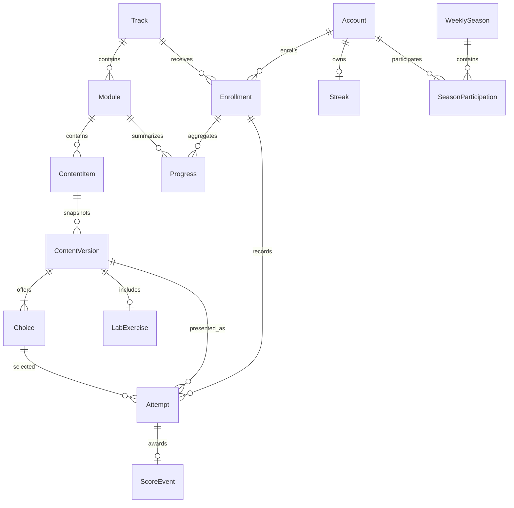

# Data Model: Contratos y esqueleto de dominio

**Date**: 2026-08-21  
**Spec**: [spec.md](spec.md)  
**Research**: [research.md](research.md)

## Entity Diagram



`Account`, `Track`, and `Module` already exist. Their relationships are shown because new entities reference them, but this feature does not alter their fields.

## Shared Conventions

- New entities use non-editable UUID primary keys.
- Cross-app foreign keys use lazy labels and `PROTECT` so history cannot disappear through cascade deletion.
- Timestamps are timezone-aware; calendar dates use the project zone `America/Bogota`.
- Counter and position fields are non-negative or positive as stated and have database checks.
- Raw idempotency keys never persist or cross domain-event boundaries. Services use `accounts.security.security_digest`: attempts hash the complete opaque key with purpose `learning.attempt.idempotency`, and attempt score events hash canonical `str(attempt.id)` with purpose `gamification.score-event.idempotency`.
- Published snapshots inherit the existing abstract `catalog.models.ImmutableModel`; updates and deletes raise `ValidationError`.
- Constraint names use the owning app prefix and remain below backend identifier limits.

## Catalog Entities

### ContentItem

Mutable aggregate root for one ordered content item inside a module.

| Field | Type | Rules |
| --- | --- | --- |
| `id` | UUID | Primary key, generated, not editable |
| `module` | FK to `catalog.Module` | Required, protected, related name `content_items` |
| `position` | Positive integer | Starts at 1; unique within module |
| `status` | String enum | `DRAFT` or `PUBLISHED`; defaults to `DRAFT` |
| `revision` | Positive big integer | Defaults to 1; stale writers are rejected by future service |
| `published_version` | Positive integer | Defaults to 0; identifies current snapshot number |
| `created_at` | Datetime | Set on creation |
| `updated_at` | Datetime | Updated on accepted mutation |

**Database invariants**:

- Unique `(module, position)`.
- `position >= 1`, `revision >= 1`.
- `status = DRAFT` or `published_version >= 1`.

**Service invariant**: Positions within a module are consecutive from 1. Future create and reorder operations lock the module sequence before assigning positions.

**Ordering**: `(module_id, position, id)`.

**State transitions**: New items start `DRAFT`. The future publication service creates the next version and atomically changes status to `PUBLISHED`, increments revision, and sets `published_version`. Editing or republishing behavior remains outside this feature.

### ContentVersion

Append-only snapshot of the exact learning content presented to learners.

| Field | Type | Rules |
| --- | --- | --- |
| `id` | UUID | Primary key |
| `content_item` | FK to `ContentItem` | Required, protected, related name `versions` |
| `version_number` | Positive integer | Unique within content item |
| `title` | String, 160 | Required |
| `learning_objective` | String, 1000 | Required |
| `lesson_text` | Text | Required |
| `case_prompt` | Text | Required |
| `source` | String, 500 | Trimmed, non-empty |
| `author` | FK to `Account` | Required, protected |
| `reviewed_on` | Date | Required |
| `published_at` | Datetime | Set on creation |

`is_current` is a read-only property: `version_number == content_item.published_version`. It is not a column and publishing never updates an old snapshot.

**Database invariants**: Unique `(content_item, version_number)` and `version_number >= 1`.

**Permissions**: View only at model permission level.

### Choice

Append-only answer option owned by one published content snapshot.

| Field | Type | Rules |
| --- | --- | --- |
| `id` | UUID | Primary key |
| `content_version` | FK to `ContentVersion` | Required, protected, related name `choices` |
| `text` | String, 1000 | Required |
| `position` | Positive small integer | Values 1 through 4; unique within version |
| `rating` | String enum | `OPTIMAL`, `PARTIAL`, or `INCORRECT` |
| `consequence` | Text | Required |
| `explanation` | Text | Required |

**Aggregate publication invariant**: A publishable version has exactly three or four consecutive choices and at least one `OPTIMAL` choice. This is checked under lock by the future publication service because it spans rows.

### LabExercise

Optional append-only laboratory attached to one content snapshot.

| Field | Type | Rules |
| --- | --- | --- |
| `id` | UUID | Primary key |
| `content_version` | One-to-one to `ContentVersion` | Required, protected, related name `lab_exercise` |
| `objective` | String, 1000 | Required |
| `initial_prompt` | Text | Required |
| `expected_artifact` | Text | Required |
| `verification_checklist` | JSON list of strings | Non-empty strings; order preserved |

The lab inherits snapshot immutability so historical content cannot change indirectly.

## Learning Entities

### Enrollment

Unique relationship between an account and a track.

| Field | Type | Rules |
| --- | --- | --- |
| `id` | UUID | Primary key |
| `account` | FK to `Account` | Required, protected, related name `enrollments` |
| `track` | FK to `catalog.Track` | Required, protected, related name `enrollments` |
| `enrolled_at` | Datetime | Set on creation |
| `status` | String enum | `ACTIVE` or `WITHDRAWN`; defaults to `ACTIVE` |

**Database invariant**: Unique `(account, track)`.

**State transitions**: `ACTIVE -> WITHDRAWN`; re-enrollment behavior is owned by the future enrollment service and must reuse the unique row.

### Attempt

Immutable record of one answer against the exact content snapshot presented.

| Field | Type | Rules |
| --- | --- | --- |
| `id` | UUID | Primary key |
| `enrollment` | FK to `Enrollment` | Required, protected, related name `attempts` |
| `content_version` | FK to `catalog.ContentVersion` | Required, protected, related name `attempts` |
| `choice` | FK to `catalog.Choice` | Required, protected, related name `attempts` |
| `rating` | String enum | Same values as `Choice.rating`; copied at registration |
| `attempted_at` | Datetime | Set on creation |
| `is_first_scoreable` | Boolean | Defaults false |
| `idempotency_digest` | String, 64 | HMAC-SHA256; globally unique; not editable |

**Database invariants**:

- Unique `idempotency_digest`.
- Conditional unique `(enrollment, content_version)` where `is_first_scoreable = true`.

**Service invariants**: Choice belongs to content version; content belongs to enrollment's track; rating is server-derived from Choice. Attempts are append-only after creation.

**Idempotency derivation**: The future producer computes `security_digest(idempotency_key, purpose="learning.attempt.idempotency")` before persistence and event delivery.

### Progress

Replaceable aggregate for one enrollment and module.

| Field | Type | Rules |
| --- | --- | --- |
| `id` | UUID | Primary key |
| `enrollment` | FK to `Enrollment` | Required, protected, related name `module_progress` |
| `module` | FK to `catalog.Module` | Required, protected, related name `enrollment_progress` |
| `completed_items` | Positive integer | Defaults to 0 |
| `total_items` | Positive integer | Defaults to 0 |
| `correct_attempts` | Positive integer | Defaults to 0 |
| `updated_at` | Datetime | Updated on recomputation |

**Database invariants**: Unique `(enrollment, module)`, `completed_items <= total_items`, and all counters non-negative.

**Service invariant**: Module belongs to the enrollment's track. Values are recomputed from authoritative content and attempts, never accepted from the client.

## Gamification Entities

### ScoreEvent

Append-only gamification fact. One scoreable attempt produces at most one event containing base points plus streak bonus. A future completed-session receiver may use a zero-amount event as its idempotency receipt.

| Field | Type | Rules |
| --- | --- | --- |
| `id` | UUID | Primary key |
| `cause` | String, 64 | Stable identifier; `attempt` for attempt awards |
| `amount` | Positive integer | Zero allowed |
| `attempt` | Optional one-to-one to `learning.Attempt` | Protected; required when cause is `attempt` |
| `occurred_at` | Datetime | Set on creation |
| `idempotency_digest` | String, 64 | HMAC-SHA256; globally unique; not editable |

**Database invariants**: Unique `idempotency_digest`; unique non-null attempt; `amount >= 0`; cause `attempt` requires an attempt. No cause-specific database constraint requires `session_completed` to have amount zero or a null attempt.

**Idempotency derivation**: Cause `attempt` uses `security_digest(str(attempt.id), purpose="gamification.score-event.idempotency")`. Persistence accepts a future `session_completed` receipt with amount zero and no attempt; its receiver owns that combination and stores the pre-derived 64-character digest delivered by the event. Any other cause must define its canonical input and purpose before implementation.

### Streak

One activity streak aggregate per account.

| Field | Type | Rules |
| --- | --- | --- |
| `id` | UUID | Primary key |
| `account` | One-to-one to `Account` | Required, protected, related name `streak` |
| `current_length` | Positive integer | Defaults to 0 |
| `longest_length` | Positive integer | Defaults to 0; not less than current |
| `last_activity_date` | Optional date | Interpreted in project timezone |

### WeeklySeason

Canonical, non-overlapping project week.

| Field | Type | Rules |
| --- | --- | --- |
| `id` | UUID | Primary key |
| `starts_on` | Date | Unique; `current_season` derives Monday in project timezone |
| `ends_on` | Date | Unique; `current_season` derives Sunday exactly six days later |

Portable checks require `starts_on <= ends_on`. `current_season` is the public creation path and always derives canonical Monday-Sunday dates. PostgreSQL additionally enforces no overlap with an exclusion constraint on the inclusive date range.

### SeasonParticipation

Weekly aggregate for one account.

| Field | Type | Rules |
| --- | --- | --- |
| `id` | UUID | Primary key |
| `season` | FK to `WeeklySeason` | Required, protected, related name `participations` |
| `account` | FK to `Account` | Required, protected, related name `season_participations` |
| `weekly_points` | Positive integer | Defaults to 0 |
| `correct_scoreable_attempts` | Positive integer | Defaults to 0 |
| `total_scoreable_attempts` | Positive integer | Defaults to 0 |
| `completed_sessions` | Positive integer | Defaults to 0 |

**Database invariants**: Unique `(season, account)`; all counters non-negative; correct attempts do not exceed total attempts.

**Write ownership**: `gamification` is the sole writer. Future gamification receivers update `weekly_points`, `correct_scoreable_attempts`, and `total_scoreable_attempts` from `attempt_registered`; they update `completed_sessions` from `session_completed`. The completed-session receiver first creates a zero-amount `ScoreEvent` with cause `session_completed` and the event's pre-derived digest, so a database uniqueness constraint prevents duplicate increments.

## Immutable Projection Types

These are frozen dataclasses, not database entities.

| Type | Fields |
| --- | --- |
| `AttemptResult` | `attempt`, `rating`, `is_scoreable`, `consequence`, `explanation`, `source` |
| `TrackProgress` | `percentage`, ordered tuple `modules`, `accuracy` (`None` when no attempts) |
| `LeaderboardEntry` | `display_name`, `position`, `weekly_points`, `correct_scoreable_attempts`, `total_scoreable_attempts`, `completed_sessions` |
| `ContentMetrics` | `context`, `person_count`, `is_suppressed`, read-only `values` |
| `EngagementMetrics` | `context`, `person_count`, `is_suppressed`, read-only `values` |

Percentages use decimal values in the inclusive range 0 through 100. Metric values are numeric and use stable documented names. When metrics are suppressed, `values` is empty.

## Migration Graph

```text
accounts/0003 ─────────────────────────────┐
catalog/0001 ──> catalog/0002_domain_content ──> learning/0001_initial
                                                   │
                                                   └──> gamification/0001_initial
accounts/0003 ─────────────────────────────────────────> gamification/0001_initial
```

- `catalog/0002_domain_content.py` depends on `catalog/0001_initial.py` and the swappable account model.
- `learning/0001_initial.py` depends on `catalog/0002_domain_content.py` and the swappable account model.
- `gamification/0001_initial.py` depends on `learning/0001_initial.py` and the swappable account model.
- No parallel feature may add a migration to these apps without an approved contract amendment.
