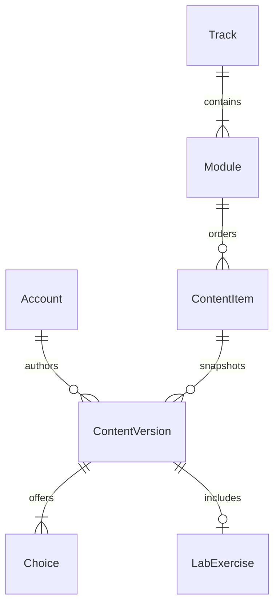

# Data Model: Publicacion de unidades de aprendizaje

**Date**: 2026-08-22  
**Spec**: [spec.md](spec.md)  
**Research**: [research.md](research.md)

## Alcance del modelo

La feature extiende el esquema de feature 004 con el estado editorial explicito de `ContentVersion`. No agrega tablas. El corpus editorial autoritativo es un archivo JSON versionado que se parsea a estructuras inmutables antes de cualquier escritura; los modelos Django siguen siendo la persistencia autoritativa del contenido publicado.



## Entidades persistidas

### Track

Ruta de aprendizaje mutable reconocida por su `title_key` canonico.

| Campo relevante | Regla en esta feature |
| --- | --- |
| `title`, `title_key` | El titulo estable identifica uno de los dos tracks; `title_key` conserva la unicidad global. |
| `description`, `audience` | Se crean desde la definicion; una diferencia compatible se actualiza mediante el servicio existente. |
| `position` | La asigna el servicio existente al crear; no forma parte de la identidad del conjunto. |
| `status` | Debe terminar en `ACTIVE`. |
| `revision` | Protege escrituras optimistas y aumenta solo cuando cambia el track. |
| `published_version` | Apunta a la instantanea publicada vigente del track. |

### Module

Contenedor mutable reconocido por `(track, title_key)`.

| Campo relevante | Regla en esta feature |
| --- | --- |
| `track` | Debe ser uno de los dos tracks objetivo. |
| `title`, `title_key` | El titulo estable identifica el unico modulo administrado dentro del track. |
| `objective` | Se crea desde la definicion y se reconcilia mediante el servicio existente. |
| `position` | La asigna el servicio existente; las unidades se ordenan dentro de este modulo. |
| `status` | Debe terminar en `ACTIVE`. |
| `revision` | Se comprueba al agregar una unidad y aumenta con cada alta aceptada. |
| `published_version` | Apunta a la instantanea publicada vigente del modulo. |

### ContentItem

Identidad mutable de una unidad de aprendizaje, reconocida por `(module, position)` solo despues de comprobar su linaje compatible.

| Campo | Tipo | Reglas |
| --- | --- | --- |
| `id` | UUID | Identidad persistente; nunca cambia en una reconciliacion. |
| `module` | FK protegida | Modulo propietario. |
| `position` | Entero positivo | Unico por modulo; secuencia consecutiva desde 1. |
| `status` | `DRAFT` o `PUBLISHED` | Nace `DRAFT`; la primera publicacion lo deja `PUBLISHED`. |
| `revision` | Entero positivo | Empieza en 1 y aumenta una vez por publicacion aceptada. |
| `published_version` | Entero no negativo | Empieza en 0; despues de publicar apunta exactamente a la version vigente. |

Restricciones existentes: unicidad `(module, position)`, posicion y revision positivas, y toda unidad `PUBLISHED` tiene `published_version >= 1`.

### ContentVersion

Instantanea aprobada, trazable e inmutable. El estado editorial se conserva explicitamente; no existe un estado editable separado en el esquema.

| Campo | Tipo | Reglas de publicacion |
| --- | --- | --- |
| `content_item` | FK protegida | Unidad propietaria bloqueada durante la publicacion. |
| `version_number` | Entero positivo | `published_version + 1`; unico dentro de la unidad. |
| `title` | Texto, 160 | Obligatorio y sin espacios exteriores. |
| `learning_objective` | Texto, 1000 | Obligatorio. |
| `lesson_text` | Texto | Microleccion obligatoria. |
| `case_prompt` | Texto | Caso ficticio obligatorio. |
| `source` | Texto, 500 | Referencia editorial obligatoria; contiene el marcador estable de linaje para datos controlados. |
| `author` | FK protegida | Actor persistido y autorizado, derivado por el servicio. |
| `reviewed_on` | Fecha | Obligatoria y no futura. |
| `editorial_status` | Texto, 9 | Siempre `PUBLISHED`; lo deriva el servicio y no lo acepta del corpus ni del llamador. |
| `published_at` | Fecha y hora | Generada al insertar; nunca cambia. |

Restricciones: unicidad `(content_item, version_number)`, numero positivo, fuente no vacia y check `editorial_status = PUBLISHED`. `ImmutableModel` rechaza actualizaciones y eliminaciones.

### Choice

Opcion inmutable perteneciente a una sola version.

| Campo | Regla |
| --- | --- |
| `position` | Entero de 1 a 4, unico dentro de la version; la secuencia debe ser consecutiva desde 1. |
| `text` | Obligatorio, maximo 1000 y no repetido dentro de la version tras normalizar espacios y mayusculas. |
| `rating` | `OPTIMAL`, `PARTIAL` o `INCORRECT`; al menos una opcion por version es `OPTIMAL`. |
| `consequence`, `explanation` | Textos obligatorios. |

Cada version tiene exactamente tres o cuatro opciones, segun su definicion aprobada.

### LabExercise

Laboratorio inmutable y opcional, con relacion uno a uno con `ContentVersion`.

| Campo | Regla |
| --- | --- |
| `objective` | Texto obligatorio, maximo 1000. |
| `initial_prompt` | Texto obligatorio. |
| `expected_artifact` | Texto obligatorio. |
| `verification_checklist` | Lista no vacia de textos no vacios, con orden preservado. |

Las siete versiones vigentes del track principal tienen laboratorio. Las tres versiones vigentes del secundario no lo tienen. Las versiones historicas conservan su laboratorio original aunque una version posterior cambie esa composicion.

## Entidades no persistidas

### Definicion JSON

`catalog/content_data/learning_units.json` es la unica fuente autoritativa del corpus aprobado. Contiene dos tracks, un modulo por track y diez unidades completas. Usa el titulo canonico `Fundamentos de negocio para equipos técnicos`; la variante sin tilde solo pertenece a los metadatos de reconciliacion legacy. El parser rechaza claves desconocidas, campos ausentes, tipos incorrectos y cardinalidades invalidas antes de abrir la transaccion de escritura.

### TrackDefinition

Dataclass congelada producida por el parser JSON con `title`, `description`, `audience`, metadatos de publicacion del track, aliases legacy, una `ModuleDefinition` y una tupla ordenada de unidades. El conjunto publicado contiene exactamente dos instancias.

### ModuleDefinition

Dataclass congelada con `title`, `objective`, metadatos de publicacion y unidades. Hay una por track; contiene siete unidades para el principal y tres para el secundario.

### ContentUnitDefinition

Dataclass congelada con `position`, `source_marker`, campos de la version, fecha de revision, tupla de tres o cuatro `ChoiceDefinition`, laboratorio opcional y huella legacy opcional. No contiene autor, estado editorial, numero de version, fecha de publicacion ni IDs; esos valores los deriva el servicio.

### ChoiceDefinition y LabDefinition

Estructuras congeladas que reflejan los campos validables de `Choice` y `LabExercise`. Las colecciones son tuplas para impedir mutacion durante una carga.

### ContentLoadOutcome

Resultado inmutable del servicio de reconciliacion:

| Campo | Significado |
| --- | --- |
| `changed` | Indica si la ejecucion creo o publico algun dato. |
| `track_count` | Cantidad final administrada; siempre 2 en exito. |
| `module_count` | Cantidad final administrada; siempre 2 en exito. |
| `content_item_count` | Cantidad final administrada; siempre 10 en exito. |
| `items_created` | Borradores creados en esta ejecucion. |
| `versions_created` | Versiones de unidad publicadas en esta ejecucion. |

No incluye cuentas, correos, UUID ni contenido narrativo.

## Identidad y compatibilidad

| Nivel | Clave natural | Comprobacion adicional |
| --- | --- | --- |
| Track | `title_key` | Debe corresponder al titulo canonico; el alias secundario sin tilde se acepta solo para converger esa fila al titulo canonico. |
| Modulo | `(track, title_key)` | Debe corresponder al modulo definido para el track. |
| Unidad | `(module, position)` | Borrador sin versiones, marcador de fuente esperado o huella legacy exacta. |
| Opcion | `(content_version, position)` | La instantanea completa debe coincidir para considerar convergencia. |
| Laboratorio | `content_version` | Presencia y campos completos deben coincidir con la definicion. |

El marcador de fuente tiene un prefijo estable y unico por unidad. La huella legacy solo se define para la posicion 1 de cada track e incluye fuente, textos, opciones y laboratorio conocidos de feature 004. Un titulo o texto aislado nunca basta para adoptar contenido.

## Transiciones de estado

```text
Unidad inexistente
  -> create_content_draft
  -> DRAFT, revision 1, published_version 0
  -> publish_content_item
  -> PUBLISHED, revision 2, published_version 1

Unidad PUBLISHED compatible y distinta
  -> publish_content_item
  -> PUBLISHED, revision + 1, published_version + 1

Unidad PUBLISHED identica
  -> sin operacion

Unidad incompatible, posicion extra o secuencia rota
  -> ContentLoadConflict
  -> rollback total
```

Cada transicion publicada agrega una instantanea; ninguna actualiza ni elimina `ContentVersion`, `Choice` o `LabExercise` existentes.

## Cardinalidad final

| Relacion | Resultado esperado |
| --- | --- |
| Tracks administrados | 2 |
| Modulos administrados | 2, uno por track |
| Unidades vigentes | 10: 7 principales y 3 secundarias |
| Opciones por version vigente | 3 o 4 segun la definicion |
| Laboratorios vigentes | 7 principales, 0 secundarios |

## Migraciones

`catalog/migrations/0003_contentversion_editorial_status.py` agrega el campo `editorial_status`, rellena las versiones existentes con `PUBLISHED` y añade un check constraint que solo permite ese valor. La migracion debe validarse en PostgreSQL 16, incluido el estado de versiones creadas por feature 004. Las restricciones de `catalog/0002_domain_content.py` y el lock singleton de `CatalogState` permanecen sin cambios.