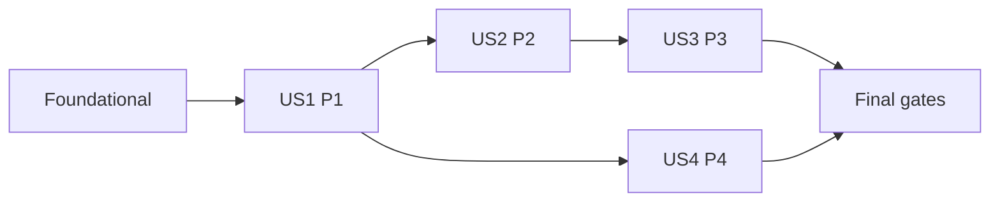

---

description: "Task list for publishing the initial versioned learning units"
---

# Tasks: Publicacion de unidades de aprendizaje

**Input**: Design documents from `/specs/005-publish-learning-units/`

**Prerequisites**: [plan.md](plan.md), [spec.md](spec.md), [research.md](research.md), [data-model.md](data-model.md), [contracts/](contracts/), [quickstart.md](quickstart.md)

**Tests**: Las pruebas son obligatorias por FR-017 y la constitucion. El corpus editorial se redacta y aprueba antes de usarlo como fixture autoritativa; para el codigo se escriben pruebas, se observa el fallo esperado y solo entonces se implementa.

**Organization**: Las tareas se agrupan por historia de usuario y respetan el manifiesto cerrado de [plan.md](plan.md). Permanecen cerrados `seed_demo`, URLs, templates, CI, migraciones existentes y artefactos de features 001-004.

## Format: `[ID] [P?] [Story] Description`

- **[P]**: Puede realizarse en paralelo cuando no comparte archivo ni depende de una tarea incompleta.
- **[Story]**: Vincula la tarea con US1, US2, US3 o US4.
- Cada tarea incluye una ruta exacta del repositorio.

## Reviewer Gates

- Antes de implementar codigo, un revisor debe evaluar los requisitos aplicables de [checklists/content-deployment.md](checklists/content-deployment.md). Sus marcadores son propiedad del revisor.
- Despues de redactar T011 y antes de implementar T018-T022, un revisor editorial debe aprobar el corpus completo en `catalog/content_data/learning_units.json`; las pruebas no duplican sus textos como una segunda fuente de verdad.
- Antes del despliegue, se debe adjuntar al PR la evidencia manual de SC-007 descrita en [quickstart.md](quickstart.md).

## Phase 1: Setup (Shared Infrastructure)

**Purpose**: Preparar exclusivamente los paquetes nuevos autorizados por el plan.

- [x] T001 Crear los marcadores de paquete `catalog/content_data/__init__.py`, `catalog/management/__init__.py` y `catalog/management/commands/__init__.py`

---

## Phase 2: Foundational (Blocking Prerequisites)

**Purpose**: Fijar esquema, configuracion, frontera de cuentas y tipos compartidos antes de las historias.

**CRITICAL**: Completar esta fase antes de cualquier historia y seguir el orden prueba fallida -> implementacion -> prueba verde.

- [x] T002 [P] Crear pruebas fallidas del contrato `resolve_content_admin`, incluidos referencia invalida, cuenta ausente, inactiva, sin rol y lock transaccional, en `tests/accounts/test_queries.py`
- [x] T003 [P] Agregar pruebas fallidas del campo inmutable `ContentVersion.editorial_status`, valor unico `PUBLISHED` y backfill de versiones existentes en `tests/catalog/test_models.py` y `tests/catalog/test_migrations.py`
- [x] T004 [P] Actualizar pruebas fallidas de firmas, excepciones y `ContentLoadOutcome` en `tests/catalog/test_domain_contracts.py`
- [x] T005 [P] Crear pruebas fallidas de dataclasses congeladas y parser JSON estricto en `tests/catalog/test_learning_content_data.py`
- [x] T006 Implementar `resolve_content_admin(actor_ref, for_update=False)` con errores genericos y lectura exclusiva del modelo de cuenta en `accounts/services/queries.py`
- [x] T007 Agregar `ContentVersion.EditorialStatus.PUBLISHED`, el campo `editorial_status` y su check constraint en `catalog/models.py`
- [x] T008 Crear `catalog/migrations/0003_contentversion_editorial_status.py` para rellenar versiones existentes con `PUBLISHED` y aplicar el constraint
- [x] T009 Implementar dataclasses congeladas y parser cerrado de JSON en `catalog/content_data/definitions.py` y exportar la API de carga desde `catalog/content_data/__init__.py`
- [x] T010 Definir `CONTENT_AUTHOR_ACCOUNT_ID` como setting opcional obtenido del entorno en `kronolearn/settings/base.py` y documentar solo su nombre en `.env.example`; solo el comando exige que tenga valor

**Checkpoint**: El esquema conserva estado editorial, `accounts` posee la identidad, la configuracion es server-side y el parser de datos existe sin corpus aun.

---

## Phase 3: User Story 1 - Publicar el catalogo inicial completo (Priority: P1) MVP

**Goal**: Una carga de despliegue crea o reconoce los dos tracks y sus modulos, publica las diez unidades completas en orden y una repeticion no escribe nada.

**Independent Test**: Sobre una base vacia o con las dos unidades legacy compatibles, una carga termina con 2 tracks, 2 modulos y 10 unidades vigentes en orden 7/3; la segunda conserva IDs, revisiones, versiones y fechas y reporta cero creaciones.

### Editorial source for User Story 1

- [x] T011 [US1] Redactar el corpus español completo y determinista con titulo secundario canonico, metadatos, marcadores, huellas legacy, opciones 3/4 y laboratorios 7/0 en `catalog/content_data/learning_units.json`
- [x] T012 [US1] Obtener aprobacion editorial del corpus y registrar el resultado en el PR usando los criterios de `specs/005-publish-learning-units/checklists/content-deployment.md`

### Tests for User Story 1

- [x] T013 [P] [US1] Completar pruebas del JSON aprobado: esquema cerrado, temas, campos obligatorios, fuentes, fechas, opciones 3/4, valoraciones, laboratorios 7/0 y datos ficticios en `tests/catalog/test_learning_content_data.py`
- [x] T014 [P] [US1] Crear pruebas de camino valido para alta consecutiva de borradores y publicacion atomica con estado `PUBLISHED`, opciones y laboratorio en `tests/catalog/test_content_publication.py`
- [x] T015 [P] [US1] Crear pruebas de carga desde base vacia, alias legacy sin tilde, titulo canonico con tilde, reconciliacion de posiciones 1 y rollback ante fallo inyectado en `tests/catalog/test_learning_content_load.py`
- [x] T016 [P] [US1] Crear pruebas del comando sin argumentos de identidad, lectura de settings, salida 2/2/10, segunda salida sin cambios y ausencia de ORM en `tests/catalog/test_load_learning_content_command.py`
- [x] T017 [US1] Agregar pruebas PostgreSQL de dos cargas simultaneas y dos altas de borrador sobre la misma revision con conexiones separadas y barrera en `tests/catalog/test_learning_content_load.py`

### Implementation for User Story 1

- [x] T018 [US1] Definir `ContentRevisionConflict`, `ContentLoadConflict`, `ContentLoadOutcome` y helpers compartidos en `catalog/services/content.py`
- [x] T019 [US1] Implementar autorizacion mediante `resolve_content_admin`, lock de modulo, revision esperada, posicion consecutiva y alta atomica en `create_content_draft` dentro de `catalog/services/content.py`
- [x] T020 [US1] Implementar `publish_content_item` para derivar autor y `PUBLISHED`, crear version, opciones y laboratorio y actualizar la unidad atomicamente en `catalog/services/content.py`
- [x] T021 [US1] Implementar `load_learning_content` con validacion previa 2/2/10, locks actor-`CatalogState`, alias legacy, servicios de track/modulo, reconciliacion por linaje y servicios de unidad en `catalog/services/content.py`
- [x] T022 [US1] Implementar el adaptador `load_learning_content` sin argumentos, usando `settings.CONTENT_AUTHOR_ACCOUNT_ID` y el parser JSON, con resumen sanitizado en `catalog/management/commands/load_learning_content.py`
- [x] T023 [US1] Ejecutar y dejar verdes los tests SQLite de US1 en `tests/accounts/test_queries.py`, `tests/catalog/test_learning_content_data.py`, `tests/catalog/test_content_publication.py`, `tests/catalog/test_learning_content_load.py` y `tests/catalog/test_load_learning_content_command.py`

**Checkpoint**: US1 es demostrable sobre base vacia y estado legacy; no queda lista para despliegue hasta completar las historias y gates restantes.

---

## Phase 4: User Story 2 - Impedir publicaciones incompletas (Priority: P2)

**Goal**: Rechazar identidad, payloads, JSON, opciones, laboratorios y estados incompatibles sin dejar una version ni carga parcial.

**Independent Test**: Una matriz que varia cada campo obligatorio, limites 2/3/4/5 de opciones, posiciones, duplicados, valoraciones, metadatos, laboratorio, configuracion y autorizacion solo acepta snapshots completos y deja cero filas parciales.

### Tests for User Story 2

- [x] T024 [P] [US2] Agregar la matriz fallida de autorizacion, revision, textos, limites, fecha, opciones repetidas, secuencia, rating, opcion optima y laboratorio a `tests/catalog/test_content_publication.py`
- [x] T025 [P] [US2] Agregar casos fallidos de JSON invalido, unidad adicional, hueco, posicion ajena, configuracion ausente, cuenta invalida y mensajes sanitizados en `tests/catalog/test_learning_content_data.py`, `tests/catalog/test_learning_content_load.py` y `tests/catalog/test_load_learning_content_command.py`

### Implementation for User Story 2

- [x] T026 [US2] Completar validadores de payload, definicion, opciones y laboratorio y normalizar revisiones e integridad a excepciones de dominio en `catalog/services/content.py`
- [x] T027 [US2] Traducir configuracion, permisos, validacion y colisiones a `CommandError` generico sin correo, UUID, credenciales ni datos de conexion en `catalog/management/commands/load_learning_content.py`
- [x] T028 [US2] Ejecutar y dejar verdes los tests SQLite de rechazo y privacidad en `tests/accounts/test_queries.py`, `tests/catalog/test_content_publication.py`, `tests/catalog/test_learning_content_data.py`, `tests/catalog/test_learning_content_load.py` y `tests/catalog/test_load_learning_content_command.py`

**Checkpoint**: US2 demuestra que ninguna publicacion o carga incompleta alcanza estado persistido ni filtra identidad.

---

## Phase 5: User Story 3 - Conservar versiones publicadas (Priority: P3)

**Goal**: Mantener snapshots congelados con estado editorial y crear una unica version posterior cuando cambia contenido controlado valido.

**Independent Test**: Toda mutacion o eliminacion de version, opciones y laboratorio falla; una correccion valida crea el siguiente numero `PUBLISHED`, preserva el snapshot anterior y una carrera no duplica versiones.

### Tests for User Story 3

- [x] T029 [US3] Agregar casos de correccion, numeracion, estado editorial, preservacion de autor/fuente/fecha y rechazo de mutacion o borrado en `tests/catalog/test_content_publication.py`
- [x] T030 [US3] Agregar pruebas PostgreSQL de dos publicaciones sobre la misma revision y de reconciliacion distinta una sola vez en `tests/catalog/test_content_publication.py` y `tests/catalog/test_learning_content_load.py`

### Implementation for User Story 3

- [x] T031 [US3] Completar republicacion, comparacion integral incluido `PUBLISHED` y traduccion de carreras a `ContentRevisionConflict` sin modificar historia en `catalog/services/content.py`
- [x] T032 [US3] Ejecutar y dejar verdes los tests de versionado e inmutabilidad en `tests/catalog/test_content_publication.py`, `tests/catalog/test_learning_content_load.py` y `tests/catalog/test_models.py`

**Checkpoint**: US3 demuestra trazabilidad explicita y una sola version nueva por correccion aceptada.

---

## Phase 6: User Story 4 - Estudiar desde el primer dia (Priority: P4)

**Goal**: El contrato de lectura existente entrega las diez versiones vigentes, completas y ordenadas despues de la carga.

**Independent Test**: Una consulta por track devuelve solo versiones vigentes de modulos activos, siete y tres respectivamente, en orden, con opciones, retroalimentacion y laboratorios segun el track.

### Tests for User Story 4

- [x] T033 [US4] Agregar una prueba de lectura learner-facing de las diez versiones `PUBLISHED`, orden 7/3 y componentes asociados en `tests/catalog/test_learning_content_load.py`

### Implementation for User Story 4

- [x] T034 [US4] Completar la activacion idempotente de modulos y tracks y la seleccion de version vigente compatible con `list_published_versions` en `catalog/services/content.py`
- [x] T035 [US4] Ejecutar y dejar verde el escenario de lectura posterior a la carga en `tests/catalog/test_learning_content_load.py`

**Checkpoint**: Las cuatro historias son verificables sin interfaz nueva y el contenido queda disponible mediante el contrato existente.

---

## Phase 7: Deployment, Editorial Evidence & Cross-Cutting Gates

**Purpose**: Integrar el procedimiento operativo y reunir evidencia automatizada y humana antes del despliegue.

- [x] T036 Verificar la variable privada y el orden `migrate -> load_learning_content -> start` en `.env.example` y `docs/deployment/railway.md`
- [x] T037 Ejecutar Ruff, Django system check y `makemigrations --check --dry-run` siguiendo `specs/005-publish-learning-units/quickstart.md`
- [x] T038 Ejecutar `tests.accounts.test_queries`, todos los tests `tests.catalog` y la matriz de migracion/concurrencia con PostgreSQL 16 siguiendo `specs/005-publish-learning-units/quickstart.md`
- [ ] T039 Ejecutar la suite completa Django, la prueba de conexion PostgreSQL y `git diff --check`, y confirmar el manifiesto cerrado de `specs/005-publish-learning-units/plan.md`
- [ ] T040 Ejecutar el protocolo manual de cinco aprendices de SC-007 y adjuntar al PR evidencia anonimizada segun `specs/005-publish-learning-units/quickstart.md`

---

## Dependencies & Execution Order

### Phase Dependencies

- **Setup (Phase 1)**: Sin dependencias.
- **Foundational (Phase 2)**: Depende de Setup y bloquea todas las historias.
- **US1 (Phase 3)**: T011 y T012 fijan el corpus antes de sus pruebas e implementacion; el resto depende de Foundational.
- **US2 (Phase 4)**: Depende de US1 para endurecer publicacion, parser y cargador.
- **US3 (Phase 5)**: Depende de US1 y US2 para versionar solo contenido valido.
- **US4 (Phase 6)**: Depende de US1 y puede avanzar en paralelo con US2 y US3 cuando el estado publicado sea estable.
- **Gates (Phase 7)**: Dependen de todas las historias; T040 es evidencia humana y no forma parte de CI.

### User Story Dependency Graph



### Within Each User Story

- Aprobar el corpus antes de usarlo como fuente autoritativa.
- Para codigo, escribir pruebas y observar el fallo esperado antes de implementar.
- Validar el JSON completo antes de iniciar cualquier escritura.
- Mantener el orden de locks actor, `CatalogState`, tracks, modulos y unidades.
- Resolver cuentas solo mediante `accounts.services.queries`.
- Implementar servicios antes del adaptador de comando.
- Completar el checkpoint de la historia antes de avanzar a su dependiente.

### Parallel Opportunities

- T002-T005 pueden escribirse en paralelo en archivos de prueba distintos.
- T006, T007 y T009 pueden implementarse en paralelo despues de sus pruebas; T008 depende de T007.
- T013-T016 pueden escribirse en paralelo despues de aprobar T011-T012.
- T024 y T025 pueden escribirse en paralelo.
- US4 puede desarrollarse en paralelo con US2 y US3 despues de completar US1.
- Los gates finales se mantienen secuenciales para evitar competencia por la base de pruebas.

## Parallel Example: Foundational

```text
Task T002: servicio de cuentas en tests/accounts/test_queries.py
Task T003: estado editorial y migracion en tests/catalog/test_models.py y tests/catalog/test_migrations.py
Task T004: contratos de dominio en tests/catalog/test_domain_contracts.py
Task T005: parser JSON en tests/catalog/test_learning_content_data.py
```

## Parallel Example: User Story 1

```text
Task T013: corpus aprobado en tests/catalog/test_learning_content_data.py
Task T014: servicios validos en tests/catalog/test_content_publication.py
Task T015: reconciliacion en tests/catalog/test_learning_content_load.py
Task T016: comando en tests/catalog/test_load_learning_content_command.py
```

## Implementation Strategy

### MVP First

1. Completar Setup y Foundational.
2. Redactar y aprobar el corpus mediante T011-T012.
3. Completar US1 con pruebas fallidas y verdes.
4. Validar US1 sobre base vacia y estado legacy como MVP demostrable.
5. Completar US2, US3, US4 y todos los gates antes del despliegue.

### Incremental Delivery

1. Setup + Foundational fijan paquetes, esquema, configuracion, frontera de cuentas y parser.
2. US1 entrega el corpus aprobado y la carga valida e idempotente.
3. US2 cierra entradas invalidas, colisiones, autorizacion y privacidad.
4. US3 cierra correcciones, estado editorial, historia inmutable y carreras.
5. US4 demuestra disponibilidad ordenada por el contrato de lectura.
6. Phase 7 aporta evidencia PostgreSQL, operativa, humana y de regresion.

## Notes

- `[P]` significa archivos distintos y ausencia de dependencia pendiente.
- Cada etiqueta `[USn]` enlaza la tarea con una historia de `spec.md`.
- Las pruebas concurrentes, de migracion y rollback autoritativas requieren PostgreSQL 16.
- Los tests SQLite son suplementarios para contratos portables.
- Solo T007-T008 modifican modelo y migracion; ninguna tarea toca superficies cerradas.
