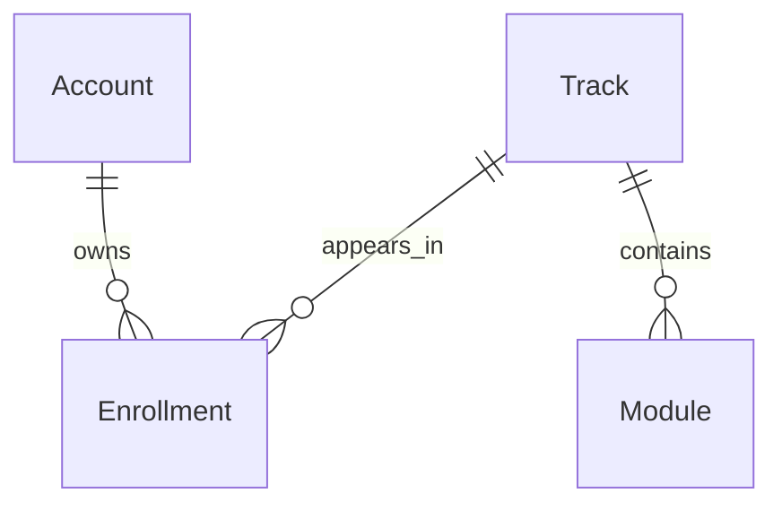

# Data Model: Espacio de aprendizaje

## Alcance del modelo

La feature no crea ni modifica entidades persistentes. Presenta una proyección de
solo lectura producida por `list_enrollments` sobre entidades existentes.

## Entidades existentes

### Account

| Campo relevante | Uso en la feature |
| --- | --- |
| `id` | Identidad interna obtenida de la sesión; nunca se renderiza ni se acepta desde la solicitud. |
| `is_active` | Debe comprobarse en el decorador existente y de nuevo en el servicio publicado. |

### Enrollment

| Campo o relación | Uso en la feature |
| --- | --- |
| `account` | Delimita las filas a la cuenta en sesión. |
| `track` | Aporta el track que se presenta y se carga junto con la inscripción. |
| `enrolled_at`, `id` | Mantienen el orden estable definido por el servicio. |
| `module_count` | Proyección entera publicada por el servicio; no es un campo persistente. |

La pantalla no añade filtros de estado. Presenta exactamente los resultados que el
servicio de inscripción declare visibles.

### Track

| Campo o relación | Uso en la feature |
| --- | --- |
| `id` | Argumento opaco para revertir la sesión del día; se usa solo en la URL del track. |
| `title` | Texto visible de la tarjeta; siempre se escapa. |
| `modules` | Relación autoritativa usada por el servicio para producir `module_count`; no se consulta desde `ui`. |

### Module

No se renderizan campos de módulos. Su única participación es el conteo total
proyectado por el servicio, incluido cero.

## Relaciones

## Proyección de lectura

Cada elemento de `enrollments` debe ofrecer:

| Dato | Tipo | Fuente | Validación |
| --- | --- | --- | --- |
| `track.id` | UUID opaco | `Track` precargado | Nunca se usa como identidad de cuenta. |
| `track.title` | Texto, máximo 160 caracteres | `Track` precargado | Escapado antes de entrar a `card.content`. |
| `module_count` | Entero no negativo | Anotación del servicio | Cero es válido; no se recalcula en presentación. |

## Reglas y transiciones

- No hay transición de estado ni escritura.
- Una cuenta sin resultados produce el estado vacío.
- Dos cuentas con datos distintos producen proyecciones disjuntas.
- Un cambio de `is_active` anterior a la evaluación de la consulta impide exponer
  inscripciones.
- No se proyectan progreso, puntos, racha, recomendaciones ni identificadores de
  cuenta.

## Migraciones

No aplica. `module_count` es un dato calculado por consulta, no una nueva columna.
