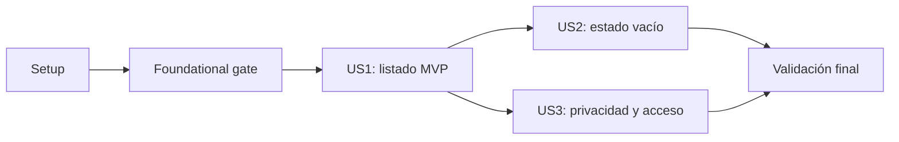

# Tasks: Espacio de aprendizaje

**Input**: Design documents from `/specs/007-learner-space/`
**Prerequisites**: `plan.md`, `spec.md`, `research.md`, `data-model.md`,
`contracts/learner-home.md`, `quickstart.md`

**Tests**: La especificación exige pruebas automatizadas. Cada historia comienza con
su contrato o prueba de regresión y ninguna tarea se completa sin ejecutar la
comprobación que le corresponde.

**Organization**: Las tareas se agrupan por historia para conservar incrementos
independientemente verificables. Ninguna tarea autoriza cambios en servicios, URLs,
settings, modelos, migraciones, componentes ni archivos de la feature 004.

## Phase 1: Setup (Shared Infrastructure)

**Purpose**: Confirmar el contexto de ejecución y el alcance antes de tocar código.

- [ ] T001 Confirmar la rama `007-learner-space`, el árbol limpio y la lista cerrada de archivos de implementación descrita en specs/007-learner-space/plan.md

**Checkpoint**: El trabajo comienza desde la rama correcta y cualquier cambio
preexistente fuera del alcance está identificado y preservado.

---

## Phase 2: Foundational (Blocking Prerequisites)

**Purpose**: Verificar las superficies publicadas que todas las historias necesitan.

**CRITICAL**: No iniciar tareas de historias hasta completar esta fase. Si falla,
detener la implementación y resolver el contrato en su feature propietaria; no
editar archivos externos desde la 007.

- [ ] T002 Verificar los tres prerequisitos de `list_enrollments` y `learning:session-current` ejecutando las comprobaciones de specs/007-learner-space/quickstart.md sin modificar learning/services/enrollment.py ni learning/urls/session.py

**Checkpoint**: `list_enrollments` revalida cuenta activa, publica `module_count` sin
N+1 y `learning:session-current` revierte con `track_id`.

---

## Phase 3: User Story 1 - Retomar un track inscrito (Priority: P1) - MVP

**Goal**: Mostrar una entrada por cada track propio con título, cantidad de módulos y
acción independiente hacia su sesión del día.

**Independent Test**: Una cuenta activa inscrita en dos tracks abre `/learn/`, ve
exactamente ambos títulos y conteos, incluido cero, y cada acción resuelve la sesión
del track correspondiente sin mostrar métricas fuera de alcance.

### Tests for User Story 1

- [ ] T003 [US1] Añadir primero pruebas fallidas para listado propio, conteos cero y múltiple, títulos iguales con enlaces distintos, escape de markup y ausencia de métricas en tests/ui/test_learner_home.py

### Implementation for User Story 1

- [ ] T004 [US1] Actualizar `learner_home` para consumir una vez `list_enrollments(request.user)` en ui/views.py, crear el listado con card y button en templates/ui/learner_home.html, eliminar ui/templates/ui/learner_home.html y ejecutar las pruebas de US1

**Checkpoint**: US1 funciona y se prueba de forma independiente; `/learn/` ya permite
elegir cualquiera de los tracks inscritos.

---

## Phase 4: User Story 2 - Descubrir qué hacer sin inscripciones (Priority: P2)

**Goal**: Orientar a una cuenta activa sin inscripciones hacia el catálogo.

**Independent Test**: Una cuenta activa sin inscripciones abre `/learn/`, ve un único
estado vacío comprensible y llega a `catalog:track-list` desde su acción principal.

### Tests for User Story 2

- [x] T005 [US2] Añadir primero pruebas fallidas para estado vacío, ausencia de tarjetas y enlace reversible al catálogo en tests/ui/test_learner_home.py

### Implementation for User Story 2

- [x] T006 [US2] Implementar la rama vacía con ui/components/empty_state.html en templates/ui/learner_home.html y ejecutar las pruebas de US2 y US1

**Checkpoint**: US2 funciona por separado y el listado de US1 continúa pasando.

---

## Phase 5: User Story 3 - Mantener privado el espacio personal (Priority: P3)

**Goal**: Preservar aislamiento por cuenta, acceso exclusivo para cuentas activas y
el destino de login existente.

**Independent Test**: Dos cuentas con inscripciones distintas no ven datos cruzados;
una solicitud anónima redirige al login con `next=/learn/`, una cuenta inactiva no
recibe contenido privado y un login válido aterriza en `/learn/`.

### Tests for User Story 3

- [ ] T007 [US3] Añadir y ejecutar pruebas de regresión para aislamiento entre dos cuentas, anónimo con `next=/learn/`, cuenta inactiva y destino de login en tests/ui/test_learner_home.py sin modificar autenticación, settings ni URLs

**Checkpoint**: US3 queda verificada sin introducir una segunda decisión de
autorización en la vista o la plantilla.

---

## Phase 6: Polish & Cross-Cutting Concerns

**Purpose**: Verificar el incremento completo, su accesibilidad y su alcance.

- [ ] T008 Ejecutar la suite enfocada, Django check, Ruff, revisión de teclado y zoom, y confirmar con `git diff --name-only` el alcance definido en specs/007-learner-space/quickstart.md

**Checkpoint**: Todos los criterios automatizados pasan, la pantalla es operable por
teclado y no hay cambios fuera de los archivos autorizados.

---

## Dependencies & Execution Order

### Phase Dependencies

- **Setup (Phase 1)**: Sin dependencias.
- **Foundational (Phase 2)**: Depende de T001 y bloquea todas las historias.
- **US1 (Phase 3)**: Depende de T002 y entrega el MVP.
- **US2 (Phase 4)**: Depende de T004 porque amplía la plantilla canónica creada por
  US1; debe volver a ejecutar US1.
- **US3 (Phase 5)**: Depende de T004 para verificar la consulta real de la vista; sus
  contratos de acceso permanecen independientes de US2.
- **Polish (Phase 6)**: Depende de T004, T006 y T007.

### User Story Dependency Graph



### Within Each User Story

- Escribir la prueba antes de la implementación correspondiente.
- Confirmar el fallo esperado antes de editar la vista o la plantilla.
- Mantener la consulta en `list_enrollments`; no consultar modelos desde `ui`.
- Ejecutar las pruebas de historias anteriores antes de cerrar cada fase.

### Parallel Opportunities

No hay tareas marcadas `[P]`. US1, US2 y US3 convergen en
`tests/ui/test_learner_home.py`; US1 y US2 también comparten la plantilla. La
ejecución secuencial evita conflictos y mantiene visible el ciclo de pruebas.

## Parallel Execution Examples

### User Story 1

```text
T003 -> T004
```

La prueba y la implementación comparten el contrato de contexto y deben ejecutarse
en orden.

### User Story 2

```text
T005 -> T006
```

La rama vacía se implementa solo después de observar fallar su prueba.

### User Story 3

```text
T007
```

Es una tarea de regresión sobre controles ya publicados; no requiere cambios de
autenticación ni una tarea de implementación separada.

---

## Implementation Strategy

### MVP First (User Story 1 Only)

1. Completar T001 y T002.
2. Completar T003 y confirmar el fallo esperado.
3. Completar T004 y ejecutar las pruebas de US1.
4. Detenerse y validar que una cuenta con dos inscripciones puede elegir cualquiera
   de sus sesiones desde `/learn/`.

### Incremental Delivery

1. **US1**: listado y enlaces por track, probado como MVP.
2. **US2**: estado vacío y acceso al catálogo, con regresión de US1.
3. **US3**: aislamiento y acceso, sin ampliar autenticación ni rutas.
4. **Final**: suite completa, accesibilidad y control de alcance.

### Scope Guard

Los únicos archivos de implementación que las tareas pueden crear, modificar o
eliminar son:

```text
ui/views.py
templates/ui/learner_home.html
ui/templates/ui/learner_home.html
tests/ui/
```

Los documentos bajo `specs/007-learner-space/` pertenecen al flujo Spec Kit. Si T002
falla, se detiene esta rama; el prerequisito se corrige y fusiona desde su propietario
antes de reanudar `/speckit-implement`.
